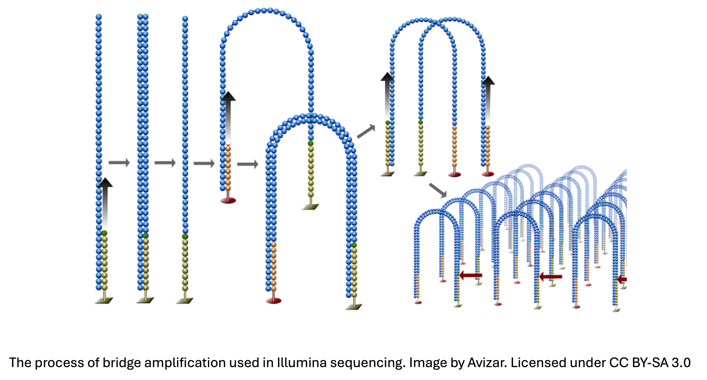

# Understanding the sequencing process

## NGS VS Sanger Sequencing
  
The key innovation that transforms DNA replication into the DNA-sequencing strategy at the core of both Sanger and NGS is the use of **unextendable, fluorescently labeled modified bases**. In Sanger sequencing, only a small percentage of bases are modified (dideoxynucleotides, ddNTPs), causing random termination of fragments, whereas in Illumina technologies, all available bases are modified with reversible 3'blockers. In both sequencing techniques, when the polymerase incorporates a modified base, extension of the strand stops and, critically, this newly terminated strand is uniquely colored to reflect its most recently added base. The fundamental challenge for the sequencer, then, is to organize molecules such that their fluorescence signal is interpretable.

In Sanger sequencing, an ensemble of DNA molecules — all originating from the same position on the template but having different size due to termination at different positions — are arranged in an electric field by capillary electrophoresis, which separates them by size because DNA is negatively charged. As the molecules migrate in the presence of the electric field, they flow past a detector that registers the fluorescence intensity and color, yielding a series of peaks that can be mapped directly to a DNA sequence.

While Sanger relies on physical separation by size, the leap to NGS was made possible by **massively parallel sequencing**, where millions of unique clusters are sequenced simultaneously on a solid surface (the flow cell). Because the blockers on the nucleotides are reversible, Illumina sequencers can register the fluorescence of the added nucleotide, remove the terminator, and repeat over and over again to generate the complete reads.

| Feature | Sanger | NGS |
| :--- | :--- | :--- |
| **Throughput** | One fragment per capillary | Millions of fragments |
| **Separation** | Physical (capillary electrophoresis) | Spatial (fixed position on a flow cell) |
| **Output** | Long reads (up to 1kb), low volume | Short reads (50-300bp), massive volume |
| **Primary use** | Single gene validation, plasmid sequencing | Genomes, Transcriptomes, Epigenomes |

## Illumina sequencing

Illumina sequencers use a sequencing method called **sequencing by synthesis**. In this method, DNA strands bind to oligonucleotides on a glass slide that match the adapter sequence, and remain fixed at the same position throughout the entire sequencing reaction. For this to happen, the DNA that has been processed for sequencing, or **library** (we recommend reading the [library prep](./03_library_preparation.md) section of this repository for more information on library preparation) has to first be denatured. 
Once bound, the DNA fragment (or forward strand) serves as a template for the extension of the oligonucleotide. 

### Bridge Amplification and Cluster Generation

The glass slide of the Illumina sequencers is covered with two different, 3' extendable oligonucleotides (P5 and P7), each matching the sequence on one of the two adapters bound to the genomic DNA on the library preparation step. When the matching adapter binds, a complementary copy of the fragment of genomic DNA and, importantly, of the adapter on the opposite end are generated by the polymerase. After the initial extension, the original strand (forward strand) is denatured and washed away. 

Next, the reverse strand bends over to **bridge** and bind a complementary oligonucleotide, serving as a template for its extension. Through repeated cycles of denaturing and extension, a monoclonal **cluster** (thousands of copies of the same DNA molecule) is formed in a single spot. Importantly, longer fragments (700-800 bp) are stiffer and therefore have more problems bending, leading to poor cluster generation and a bias toward shorter fragments in the final data.

Once the cluster is formed, it contains a mixture of both forward and reverse strands tethered to the flow cell. To ensure that the sequencer reads only one direction at a time and provides a clear signal, the cluster must be **linearized**. A specific enzyme is introduced to cut only one of the oligonucleotides, thanks to the presence of a sequence specific to each. The newly freed strands are denatured and washed away and the free 3' ends of the remaining lawn oligonucleotides are chemically blocked to prevent them from interfering with the subsequent sequencing reaction.

  
   
  <em>The process of bridge amplification. Image by Abizar (CC BY-SA 3.0).</em>

### Reading the Fragments

Primers are added together with nucleotides that have a specific fluorophore for each of them and a terminator that prevents the chain from being further extended. The sequencer excites the fluorescent tag with a laser and the camera detects the fluorescent signal. The terminator is then washed away, and the process is repeated a determined number of times (**read length**). This leads to the generation of **reads**. In single-end sequencing, this would be the end of the workflow, while in paired-end reading it would conclude the generation of the first read (**R1**)

### Paired-end Sequencing

In the case of **paired-end sequencing**, where fragments are read from both ends, the machine pumps in a denaturation buffer (usually high pH, like NaOH), breaking the hydrogen bonds between the R1 sequence and the template, and the R1 strands are washed away. The templates undergo a turnaround step where they bridge and are copied one last time. An enzyme that cuts the other oligonucleotide is added before sequencing, and the strands that were used as a template to generate the R1 are washed away, leaving their exact reverse complements to be sequenced, generating the second read or **R2**.

Paired-end sequencing, although more expensive, provides much higher confidence in the sequence prediction, making it the usual go-to choice for Illumina sequencing.

### Optical Chemistry

As explained above, the sequencer identifies bases by exciting fluorophores with a laser and capturing an image. To increase sequencing speed and reduce the cost of the hardware, Illumina evolved the imaging chemistry from four colors down to two:

- **4-channel chemistry** (e.g., MiSeq, HiSeq): Each of the four bases has a unique dye and is captured in four separate images per cycle. While highly accurate, the time required for four imaging steps per cycle limits throughput.
- **2-channel chemistry** (e.g., NextSeq, NovaSeq): only two dyes are used and the sequencer takes two pictures, one through a red filter and one through a green filter. Each nucleotide bound to one (red for C and green for A), 2 (red and green for T, resulting in yellow signal), or none (G, the sequencer registers no fluorescence in that position and registers it as a G).

Note: 2-channel color mappings vary by instrument. For example, on the NextSeq 500, 'A' is detected in both channels, whereas on the NovaSeq 6000, 'T' is the mixed signal. In all 2-channel systems, 'G' is characterized by the absence of signal (dark).

  
   
  <em>Comparison of Illumina 4-Channel vs. 2-Channel optical chemistry. Note how 'G' (Guanine) relies on the absence of signal in 2-channel systems.</em>

## Long-read Sequencing

While this repository focuses on short-read Illumina sequencing, it is worth noting that long-read platforms — primarily **PacBio** (SMRT sequencing) and **Oxford Nanopore** (nanopore-based sequencing) — occupy an increasingly important role in genomics.

Unlike Illumina, neither platform uses reversible terminators or cluster amplification: PacBio reads a single molecule in real time as a polymerase traverses it, while Oxford Nanopore measures disruptions in ionic current as DNA threads through a protein pore. Both produce reads in the kilobase-to-megabase range, which makes them uniquely suited for resolving repetitive regions, phasing haplotypes, detecting structural variants, and sequencing full-length isoforms without the ambiguity introduced by read assembly. The trade-off is a higher per-base error rate and cost compared to Illumina short reads, which is why long-read platforms are typically used for specific applications rather than as a general replacement for short-read sequencing.

For most transcriptomic, epigenomic, and standard variant-calling workflows covered in this repository, short-read Illumina sequencing remains the practical and cost-effective standard.

## Patterned Flow Cells

In earlier systems (MiSeq, HiSeq), DNA fragments bind to the flow cell at random. As bridge amplification occurs, clusters can grow too close to each other, leading to fluorescence overlapping, and thereby causing the camera to fail to distinguish the two signals. To overcome this challenge, a limiting dilution of sample is used, leading to random occupancy governed by Poisson statistics, and thereby reducing the possibility that two different DNA fragments "land" too close. However, this also leads to a big part of the flow cell being empty, limiting sequencing efficiency.

Modern high-throughput machines (NovaSeq) use **patterned flow cells** where billions of nanowells are distributed on the glass at exact intervals. This allows the sequencer to know exactly where every cluster should be, maximizing the number of reads that can be obtained from a single slide. To ensure each nanowell contains only one unique DNA fragment, Illumina uses **ExAmp kinetics**. The reagents are designed so that the moment the first DNA molecule enters a well, it replicates so fast that it fills the entire volume of the well instantly. This high-speed cloning physically crowds out and excludes any other DNA molecules from entering.

## Technical Challenges

### Phasing and Pre-phasing

If the cleaving step doesn't work perfectly to wash away the terminator, the next base won't be able to bind, so this read will be one nucleotide behind. On the other hand, two nucleotides can accidentally be incorporated in one cycle because the terminator was missing or broken, so now this read will be one nucleotide ahead. These are called **phasing** and **pre-phasing**, respectively. As the run goes on (e.g., cycle 100, 150), these "out of sync" strands accumulate. This is why Quality Scores (Q30) always drop toward the end of a read (see the [sequencing QC](./04_sequencing_QC.md) section of this repository). When they drop too early, it is usually because of a chemistry or hardware issue (clogged fluidics or old reagents), and the expiry date of the reagents or the pump performance need to be checked.

### Low Quality Index Read

The adapters bound to the genomic DNA contain **indexes**: these are short sequences (usually 8 or 10 bases), different for each sample. Thanks to their presence, all samples can be sequenced together, and the sequencer can determine which reads belong to each sample in a process called **demultiplexing**.

Importantly, the sequencer reads the index as a separate, tiny sequencing run called an **index read**. This takes place at the end of R1. If the index read has low quality, the machine won't know which sample the DNA belongs to, and these reads end up in an **undetermined** folder. High percentages of undetermined reads usually point to library prep errors or issues with the sample sheet.

### Index Hopping

Because ExAmp is a high-energy chemical reaction and wells are so close together, any leftover free adapters in the library can accidentally prime a reaction in a neighboring well. This index hopping can lead to crosstalk where reads are assigned to the wrong sample. This is why modern protocols require **Unique Dual Indexes (UDIs)**, a digital safety net for the high-speed chemistry. As we will see on the next section of this repository, proper library cleanup to remove free adapters is the best defense against this phenomenon.

