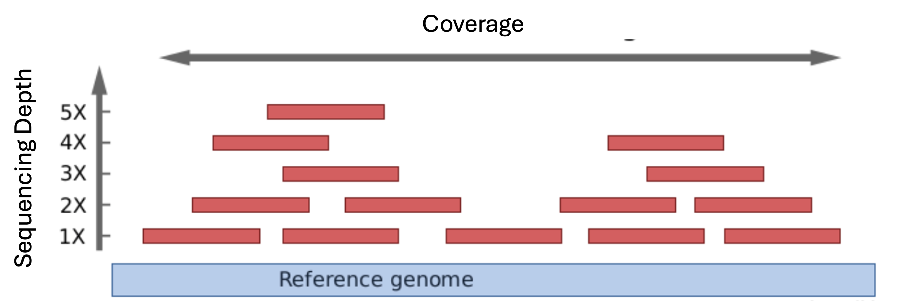

# NGS Experimental Design

In addition to standard experimental design factors, such as experimental conditions and number of replicates, NGS experiments require several parameters to be defined prior to library preparation and sequencing, including sequencing depth, replication strategy, read configuration, and total data output. Defining these correctly is essential to ensure efficient use of time and budget, and to avoid under- or over-sequencing.

## Number of Samples and Replicates

The number of samples and replicates is primarily determined by the biological question and experimental design. However, these factors have a direct impact on sequencing requirements and must be considered when planning data output and flow cell usage.

Biological replicates are essential to capture biological variability and ensure robust downstream analysis. In most cases, increasing the number of biological replicates provides greater statistical power than increasing sequencing depth beyond recommended levels.

From a sequencing perspective, there is a trade-off between the number of samples/replicates and the depth achieved per sample. Given a fixed sequencing capacity, increasing the number of replicates reduces the number of reads allocated to each sample, while unnecessarily increasing sequencing capacity leads to higher experimental costs.

## Sequencing Depth & Coverage

**Sequencing depth**, also known as read depth or depth of coverage, refers to the number of times a specific base (nucleotide) in the DNA is read during the sequencing process. In other words, it's the average number of times a given position in the genome is sequenced. A higher sequencing depth provides more confidence in the accuracy of the base calls at that position and helps to reduce sequencing errors and noise.
For example, if a specific nucleotide is sequenced 30 times, the sequencing depth at that position is 30x. This is the gold standard for whole genome sequencing (WGS) because, statistically, it ensures that >99.9% of the genome is covered by at least a few reads, minimizing the risk of missing a heterozygous variant.

Before the experiment is performed, the flow cell that will be used needs to be decided based on the aimed sequencing depth and the genome size:

$$\text{Total Data (Gb)} = \text{Genome Size (Gb)} \times \text{Desired Depth (} \times \text{)}$$

Based on this formula, a full sequencing of a human genome (around 3.2 Gb) at 30x sequencing depth, requires 96 Gb of raw data.

**Coverage** or **breadth of coverage** is closely related to sequencing depth but provides a broader perspective. Coverage is the proportion or percentage of a genome that has been sequenced at a certain depth. It gives an idea of how much of the entire genome has been effectively read and is usually expressed as a multiple of the genome's size, expressed as a percentage. For example, “95% coverage” means that 95% of the intended region has been sequenced at least once or a certain amount of times.

The higher the sequencing depth, the lower the possibility that some positions won't be sequenced or, in other words, the higher the coverage.

  
   
  <em>Representation of sequencing depth vs coverage</em>

 

## Library Pooling and Demultiplexing

To optimize sequencing capacity, multiple samples are often pooled and sequenced together using unique index sequences, a process known as multiplexing (see [library preparation](./03_library_preparation.md) section).

From an experimental design perspective, multiplexing determines how sequencing reads are distributed across samples within a run. The number of samples that can be pooled depends on the total sequencing output and the required depth per sample.

Careful planning is required to ensure balanced representation, as uneven pooling can lead to insufficient coverage for some samples while others are over-sequenced.

## Read Configuration

Sequencing experiments must also define the read configuration, including read length and whether sequencing is performed in single-end or paired-end mode.

While these topics are covered elsewhere in this repository, it is important to note here that:

- Longer reads improve alignment accuracy and detection of structural features, while shorter reads reduce cost and increase throughput.
- Paired-end sequencing provides additional information by sequencing both ends of each fragment, improving mapping accuracy and variant detection, but requires more sequencing capacity, increasing cost.

The optimal configuration depends on the application and must be balanced against cost and data requirements.

## Flow Cell Choice

Choosing the appropriate flow cell is critical for cost efficiency. Flow cells differ in total data output, and the optimal choice depends on the number of samples, biological replicates, and the required sequencing depth. Smaller flow cells are more suitable for low sample numbers or pilot experiments, as they minimize unused capacity. In contrast, high-output flow cells reduce cost per base but are only cost-effective when fully utilized. Underfilling a high-capacity flow cell can significantly increase the cost per sample, making careful planning essential.

Flow cell selection is instrument-specific and should be determined in consultation with the sequencing facility or Illumina documentation, based on the total data output required.

 

  
| Project Scale | Data Requirement | Recommended Strategy | Cost Consideration |
|--------------|------------------|----------------------|--------------------|
| Small (pilot, few samples) | Low (≤100 Gb) | Use low-output runs | Minimizes wasted capacity |
| Medium (tens of samples) | Moderate (100–1000 Gb) | Use mid-output runs or multiplex samples | Balance between flexibility and cost |
| Large (cohort studies, WGS) | High (≥1 Tb) | Use high-output runs | Lowest cost per Gb if fully utilized |

