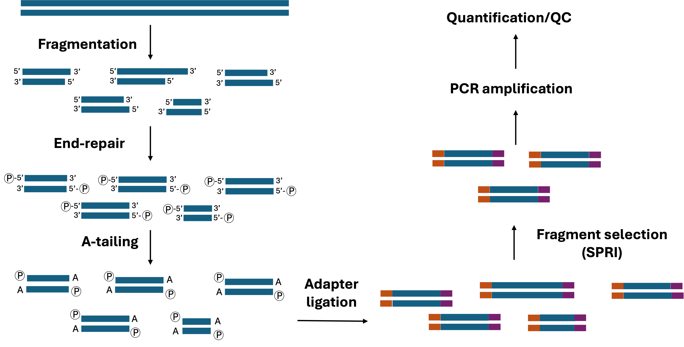
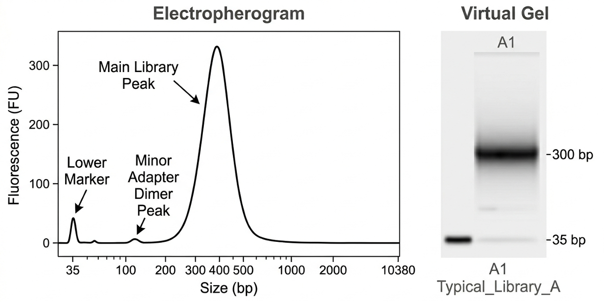

# Library Preparation

## Library Preparation Steps

Understanding the chemistry of reversible terminators explains how a single molecule is read. However, to achieve massively parallel sequencing, raw biological samples (DNA or RNA) must first be transformed into a format the sequencer can recognize, capture, and amplify. This brings us to **library preparation**.

In the first step of library preparation, the DNA (or cDNA generated from retro-transcribed RNA) is cut in specified sizes through sonication or enzymatic digestion.

Next, small pieces of DNA, known as **adapters**, are bound to the DNA. These fragments, specific for the different sequencers, contain:

- **P5 and P7 sites:** These are terminal oligos that are complementary to the lawn of primers on the Illumina flow cell. They are responsible for the physical capture of the library and act as the anchors for bridge amplification (cluster generation, see below).
- **Priming sites** (SBS priming sites): Located just "inside" the P5/P7. These are the binding sites for the sequencing primers that give rise to read 1 (R1) and read 2 (R2) in paired-end runs.
- **Index(barcode) sequences:** These are unique 8–10 bp sequences that act as a "digital tag" for the sample, so a different one needs to be used and kept track of for every sample. While a single barcode (generally i7) per sample can be used, currently the **Unique Dual Indexing (UDI)** method, where both i7 and i5 positions contain unique barcodes, is preferred (see the [sequencing physics](./01_sequencing_physics.md) section of this repository for a deeper explanation of sample indexing). The barcodes allow the sequencing software to sort millions of raw reads back into their original sample identities in a process called **demultiplexing**.

 

  
   
  <em>Sequencing library architecture</em>

 

This is the simplest workflow, mandatory for PCR-free protocols (e.g., protocols that yield enough DNA that they do not require a PCR amplification step), but also more expensive and requires a different adapter for every single sample (since the index is already on the adapter).

The most common high-throughput method involves the use of truncated (stubby) adapters, known as **TA-ligation with indexed PCR** or **universal adapter ligation**. In this protocol, adapters contain only the initial priming sites, and the library is completed during a subsequent indexed PCR step, where primers add the barcodes and the P5/P7 flow-cell binding sequences. If this PCR fails, then the sequencing will also fail, since the fragments won't contain the P5/P7 needed for the binding.

In order for the adapters to bind to the DNA, a previous step of **end repair** is required, where all fragment ends are converted to blunt, by removing the 3' overhangs and by filling and phosphorylating the 5' ends. Finally, a single A is added to the 3' end of each fragment (**“A-tailing”**). Adapters, which contain a complementary single 3′-T overhang, can now be added and bound to the fragments by a DNA ligase. T-A ligation is much more efficient than blunt-end, prevents the fragments from binding each other, which would create **chimeras**, and reduces (although doesn't eliminate) adapter dimers.

**Note:** As we will see later, in ATAC-seq adapters are incorporated during the tagmentation process, so no end-repair, A-tailing, or ligation steps are required.

 

  
   
  <em>Overview of a library preparation workflow</em>

 

In some experimental designs, a known quantity of exogenous DNA or RNA, known as **spike-in control** is added to the sample at this stage as a reference control. This spike-in strategy is covered in detail in the context of [CUT&RUN](../04_Epigenomics/02_CUT&RUN_sample_prep.md), where it is most commonly applied.

## Size Selection

A crucial step in library prep is the selection of fragments of the right size. This is mainly achieved through the use of **Solid Phase Reversible Immobilization (SPRI)** beads, like AMPure XP. The bead mix consists of three things:

-	Paramagnetic beads: iron cores coated in carboxyl groups (negative charge)
-	Polyethylene glycol (PEG)
-	NaCl
  
The process relies on charge-shielding rather than direct molecular bridging. High concentrations of NaCl provide a dense population of Na+ counter-ions that screen the electrostatic repulsion between the negatively charged DNA backbone and the carboxylated bead surface. This allows the crowding agent (PEG) to thermodynamically drive the DNA out of the aqueous phase, forcing it to collapse onto and entangle with the bead surface. This interaction is purely concentration-dependent; upon the addition of a low-salt elution buffer, the shielding is lost, and the restored electrostatic repulsion facilitates the release of the DNA.

Large DNA molecules dehydrate more easily, so they bind to the beads even at lower PEG concentrations, while small molecules are more soluble and therefore require higher PEG concentrations to bind the beads. Using different **bead volume to sample volume ratios**, different DNA sizes can be selected. A lower ratio (0.5x) captures only very large fragments, while a higher ratio (1.8x), captures almost everything.

To make sure that only the fragments of the right size are captured, a **double-sided selection** is normally used. First, a “right-side cut”, where a really low ratio (0.5x) is used, is performed. In this scenario, large pieces of DNA bind to the beads, and the rest stays on the liquid, so the beads can be discarded. Then, more beads are added to bring the total ratio up to, say, 0.8x (“left-side cut”), so that the rest of the DNA, except for small pieces like adapter dimers stick to the beads. These are kept, washed with ethanol 80% to remove contaminants, and finally eluted with water or a low-salt buffer. 80% ethanol is used because it's strong enough to keep the DNA precipitated on the beads, but contains enough water to dissolve the salts and PEG so they can be washed away. Importantly, it must be freshly prepared, as it is hygroscopic and absorbs water from the air, which can lead to DNA loss during the wash steps.

 

  
   
  <em>Overview of Solid Phase Reversible Immobilization (SPRI). Adapted from Russel AJ et al., Nature Communications (2018) under CC-BY 4.0 (https://creativecommons.org/licenses/by/4.0/deed.en).</em>

 

When performing the size selection step, two measurements need to be considered:

- The **fragment size** is the total length of the DNA fragment (genomic DNA + adapters)
- The **insert size** refers only to the genomic DNA between the two adapters

The relationship between the fragment size and the **read length**, a setting that can be selected in the sequencer, determines how the data will look to the aligner. A detailed breakdown of fragment size choice can be found in the [mapping principles & QC](../02_Mapping_&_Alignment/01_mapping_principles_&_QC.md) section of this repository.

Lastly, in some protocols the library is amplified with a PCR step, to increase the concentration of DNA (see next section). **PCR-free NGS protocols**, like whole genome-sequencing (WGS), start with a much higher initial concentration of DNA (like 1 µg), so there is already enough material to be sequenced after adapter ligation. This has some advantages: PCR polymerases naturally "dislike" areas with high GC content (promoters) or high AT content. PCR-free sequencing provides the most even coverage across the entire genome because it entirely removes enzyme preference. Additionally, PCR can sometimes introduce small insertions or deletions. On the downside, PCR-free NGS protocols contain molecules with both, only one, or no adapters. This is because such adapters are used for library amplification in libraries that have a PCR step, so virtually all fragments will contain both adapters. However, in PCR-free protocols, the adapters are not used for amplification and there is no way to guarantee that all fragments will bind to both adapters.

## Spike-in Control

A spike-in refers to a **known quantity of external (exogenous) DNA or RNA** that is added (“spiked in”) in a known concentration to a sample before processing. Spike-in acts as an internal control or reference, allowing to distinguish biological differences from technical noise. Because **it is subjected to the same procedures as the material of interest**, it can be used as a normalization step at the end of the process.

Standard normalization approaches assume that samples are broadly comparable, but some experimental conditions violate this assumption: treatments that cause global transcriptome shifts, cell types with different amounts of genetic material, or protocols where the amount of starting material varies between samples. In these cases, spike-in provides a reference that does not rely on any assumption about the biological material itself.

The underlying logic is straightforward: a ratio of spike-in reads in each sample versus a reference (either a control sample or the average across all samples) is calculated. If a sample has fewer endogenous reads but the same spike-in reads as the reference, the difference is biological. If both are reduced proportionally, the difference is technical. This requires that reads are aligned to both the genome of interest and the spike-in genome.

Because spike-in is added at a concentration designed to constitute only 1–5% of the final library, it is typically invisible on TapeStation or Bioanalyzer traces. If a spike-in signal is visible, the spike-in-to-target ratio is too high, which will require significantly greater sequencing depth to recover sufficient target reads for downstream analysis.

 

  
   
  <em>Workflow and Logic of Spike-in Normalization</em>

 

## Library Amplification by PCR

The goal of library PCR is to add the remaining adapter sequences (if using indexed primers) and to amplify the library to a measurable concentration (typically 2–10 nM for loading). When deciding on the number of PCR cycles, two scenarios need to be avoided:

-	**Under-amplification:** Leads to a library concentration below the detection limit of the Qubit or TapeStation (<0.5ng/µl), making accurate loading impossible.
-	**Over-amplification:** Leads to PCR duplicates (reducing unique data) and heteroduplexes (the "bubble product").

 

| Input DNA | Typical cycle range |
|-----------|---------------------|
| 1 µg (WGS) | 0-4 cycles |
| 50–100 ng (standard) | 5-8 cycles |
| 1–10 ng (low input) | 10-15 cycles |
| <1 ng (single-cell, ultra-low) | 18+ cycles |

 

### PCR Duplicates

Because some DNA fragments can be amplified more efficiently than others (medium GC content, no hairpins, etc.), an excessively long amplification increases the risk of overrepresentation of these fragments in the final sample. These can take more space in the flow cell, preventing detection of other fragments that, even though were present in the original sample, were not amplified to the same extent. This is often called a **reduction in library complexity or diversity**.

### The Bubble Product (heteroduplex)

In the final stages of the library PCR, primers get depleted (they run out) and there is an overabundance of DNA fragments. Instead of a primer binding to a template, two full-length library fragments denature (separate) and then accidentally anneal (re-bind) to each other. Since the adapters are identical for all fragments, they zip up perfectly. However, the genomic inserts (the middle part) are different, and thereby not complementary. The result is a DNA molecule that is double-stranded at the ends (the adapters), but single-stranded in the middle, forming a bubble (heteroduplex). These molecules are less dynamic and migrate slower in an electrophoresis, so they give rise to a high molecular weight peak. Although they have no direct impact on sequencing quality (since the sequencer denatures the DNA during the sequencing process), their presence is a diagnostic indicator of overamplification: **a library showing a strong bubble product is likely to also yield a high PCR duplicate rate after sequencing**. If observed, reducing the number of PCR cycles in future preparations is recommended.

 

  
   
  <em>Generation of bubble products during library amplification by PCR</em>

 

### Things to Consider when Designing the Library PCR

-	**Use high-fidelity polymerases** (KAPA HiFi, Q5 (NEB), or Phusion): Less error-rates and GC bias than taq polymerases, and proof-reading activity (exonuclease 3'-> 5').
-	**Hot-Start technology:** Prevents non-specific amplification at room temperature before the thermocycler starts. This is crucial for reducing primer dimers.
-	**Final concentration:** A well-designed PCR should aim for a final library concentration of >10 nM. This provides enough material for multiple sequencing runs and long-term storage.

## Library Quantification & Quality Control

For library quantification, while Nanodrop can be used as a quick first check, fluorescence-based methods like **Qubit** are required. This is because, while Nanodrop detects all species of nucleic acids, Qubit exclusively detects dsDNA, giving a more exact estimation of how much usable library there is. This is the standard quantification method for libraries that have undergone a PCR amplification step.

However, in PCR-free protocols, as mentioned before, many fragments do not have both adapters, and in consequence they won't be sequenced. Qubit will nevertheless detect these fragments, leading to an inflation in the amount of sequencing-ready DNA present in the sample. Therefore, in these protocols, the concentration must be calculated by **qPCR-based quantification** with KAPA/NEB Library Quant, which uses primers that bind to the P5/P7 adapters.

Once it is established that the library prep yielded enough material, its integrity needs to be assessed. This is mainly done by checking the fragment size distribution with instruments such as the **BioAnalyzer** or the **TapeStation**, to ensure that DNA is in the expected size range.

### Fragment Size

Both TapeStation and Bioanalyzer are microfluidic electrophoresis instruments, while the fragment analyzer uses capillary electrophoresis. For all of them, the principle is the same: samples are loaded together with a fluorescent dye and a molecular size marker and fragments are subjected to an electric field so that they separate by size. The instruments detects the fluorescent signal vs time and transforms it into bp using the provided ladder.

TapeStation takes more samples than Bioanalyzer, and the sample preparation is easier, so it's usually the preferred option. However, the fragment analyzer has higher throughput and precision than the other two, allowing greater resolution and distinction between small fragments and adapter dimers or other artifacts.
The result from fragment size analysis is presented as both an **electropherogram** and a **virtual gel**. 

Ideally, in a typical sequencing library, the TapeStation returns a main peak with the desired fragment size, that varies in width depending on the quality of the library. A smaller peak (around 120-140 bp for full adapters, or 60-80 for truncated ones) is usually seen corresponding to adapter dimers. Because full adapters are longer, then the likelihood of forming dimers is higher. 

 

<em>Example of a high-quality NGS library fragment size analysis</em>

 

The presence of a high concentration of **adapter dimers** can be problematic for several reasons:

-	Smaller molecules physically diffuse to the flow cell surface and "capture" a grafting oligo much faster than long library fragments (300-500 bp).
-	Because they are short, the bridge is easier to form, and they amplify more efficiently during cluster generation (**cluster side bias**).

Even if the library has only 5% dimers by mass, they can take up 50% or more of the clustering occupancy. Libraries with a percentage below 5% of adapter dimers are usually acceptable for sequencing.

The interpretation of fragment size profiles is assay-dependent and should always be considered in the context of the library preparation strategy and downstream application. More information on this can be found in the [fragment size distribution](../05_Troubleshooting/01_fragment_size_distribution.md) section of this repository.

### Molarity Calculation

Sequencers don't take absolute quantities of DNA, they work on molarities. In PCR-free protocols, where the quantification is done through qPCR (see above), the molarity (in nM) is already obtained. If no qPCR was done, then the formula to calculate the molarity of a library is:

$$ \text{Molarity (nM)} = \frac{\text{Concentration (ng/µL)} \times 10^6}{\text{Average Fragment Length (bp)} \times 660} $$

This is assuming the result is in nM, where 660 is the average molecular weight of a bp, the average fragment length is provided by the TapeStation/fragment analyzer, and the concentration is obtained from the mass provided by the Qubit quantification.

**Note:** Always use the region tool in the TapeStation software to capture the entire smear, not just the highest peak, to get a true average bp for the formula.

## Library Pooling

Once the molarity (nM) of each individual library is determined, they must be combined into a single **master pool**. This process ensures that the sequencing system's total clustering capacity is distributed accurately among the samples.

### The Pooling Ratio

In most NGS workflows, samples are pooled at a **1:1 molar ratio** to achieve equal read depth. Negative controls (like IgG in CUT&RUN workflows) are often pooled at a lower ratio (25% - 50% less). Given their lower biological complexity, these samples require fewer total reads to establish a statistical background, allowing more clustering capacity to be diverted to experimental targets.

### Normalization Calculation

To minimize pipetting error, libraries should be diluted to a standardized intermediate concentration (e.g., 4 nM or 10 nM) before mixing. Utilizing volumes greater than 2 µL significantly improves the precision of the final pool.

The volume of each library (Vlib) required for a specific total pool volume (Vpool) is calculated using the following formula:

$$V_{lib} = \frac{Molarity_{target} \times V_{pool}}{Molarity_{initial} \times n}$$

where n is the number of samples.

### Final Pool QC

Before the master pool is loaded onto the sequencer, a final verification step is required. This is the critical juncture for identifying technical failures before committing to the cost of a sequencing run.

An automated electrophoresis run (e.g., TapeStation) of the final master pool should exhibit a distribution reflecting the weighted average of the constituent libraries. If a clear peak of adapter dimers is found in the pool, a new SPRI purification step might be required. 

**Note:** If the overall concentration of the pool is significantly lower than the mathematical expectation, this suggests that the DNA is sticking to the tube walls (often due to using a low-cation buffer or water instead of Tris-HCl).
