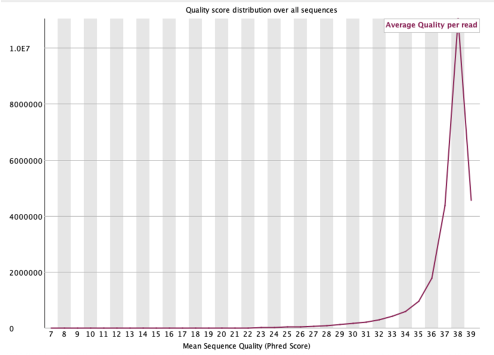
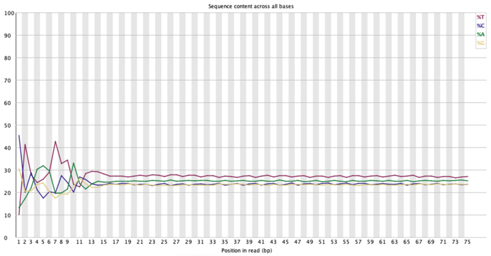
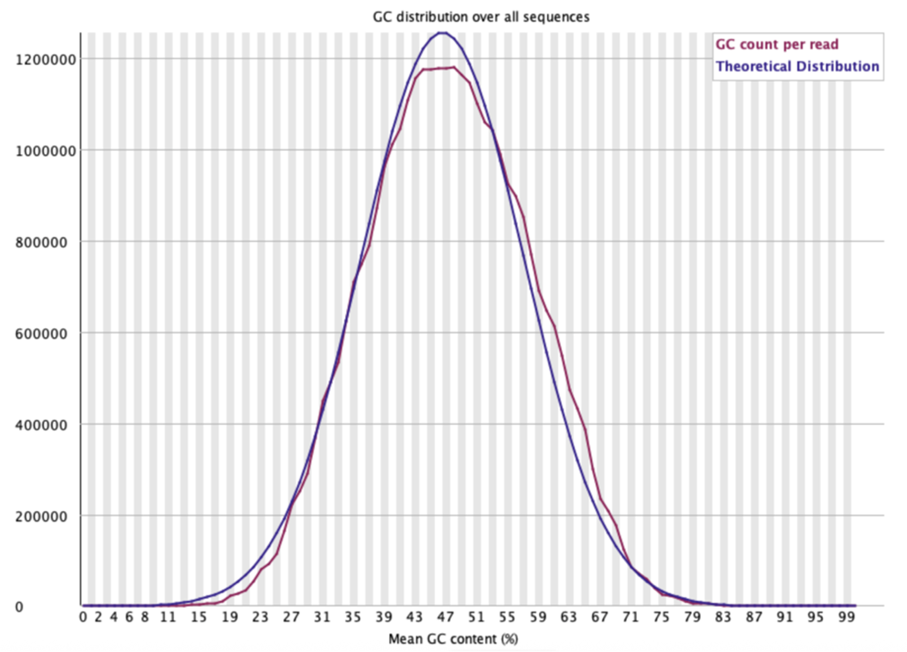

# Sequencing Data QC

After sequencing, it is critical to perform quality control (QC) to verify that the data meets the expected coverage and to identify issues that may affect downstream analysis.

## Sequence Depth VS Coverage

While  specific sequence depth and coverage (see the [experimental design](./02_experimental_design.md) section of this repo for more details on this) are defined during experimental design, it is important to check if they have been achieved once the run is over.

The observed sequencing depth achieved in a sequencing run can be calculated through the following formula:

$$\text{Sequencing Depth} = \frac{\text{Total Number of Reads} \times \text{Fragment Length (bp)}}{\text{Total Genome Size (bp)}}$$

Coverage is calculated by bioinformatics tools such as ([bedtools](https://bedtools.readthedocs.io/en/latest/) or [samtools](https://www.htslib.org)) after the mapping step, with the following formula:

$$\text{Coverage } = \left( \frac{\text{Number of bases with } \ge 1 \text{ read}}{\text{Total Genome Size}} \right) \times 100$$

One important term is **uniformity of coverage**. This is a measure of the variability of coverage across the genome. While the overall coverage might be the desired one, this is an average across all positions, so some bases might not be reaching it while others have an inflated coverage, skewing the %. This can be problematic, especially in WGS, where we want flat coverage: if a position shows a much lower coverage, then the detection of mutations with high confidence won't be possible. In contrast, applications such as ATAC-seq or CUT&RUN benefit from non-uniform (“bumpy”) coverage patterns that reflect biological signal.

The most common cause of low uniformity of coverage is **PCR bias**. Some regions are easier to amplify by the polymerase, including those with lower GC content, leading to an overrepresentation of these fragments.

The uniformity of coverage is usually calculated by tools like [Picard](https://broadinstitute.github.io/picard/) or [Mosdepth](https://github.com/brentp/mosdepth) with the following formula:

$$CV = \frac{\sigma}{\mu} = \frac{\text{Standard Deviation of Depth}}{\text{Average Sequencing Depth}}$$

The lower this metric (0.1-0.2), the more uniform the data.

## Sequencing QC

The industry standard for visualizing raw data quality is [FastQC](https://www.bioinformatics.babraham.ac.uk/projects/fastqc/). It provides the following reports:

- **Per Base Sequence Quality**

It shows the average **Phred score** for each position in the reads. The Phred score measures how confident the sequencer is that the detected base is the correct one, so the higher the score, the better the quality. The Pred score is calculated as:

$$Q = -10 \log_{10}(P)$$

where P is the probability of an incorrect base call. Q30, the usually aimed for Phred score, translates to a 1 in 1000 error rate, or a 99.9% accuracy. Scores above 28 are categorized as good quality, and the score should remain uniform throughout the whole sequence. A drop at the end is normal in Illumina sequencers and it's usually solved during the trimming process.

  
   
  <em>Example of a per base sequence quality score</em>

 

- **Per Sequence Quality Score**

Average Phred score of the bases constituting each read sequence. It shows as a histogram with ideally a unique peak at high Phred scores.

  
   
  <em>Example of a per sequence quality score</em>

 

- **Per Base Sequence Content**

Shows the proportion of each nucleotide for each position in our reads. This proportion should be roughly the same for all nucleotides. We should therefore see straight lines very close to each other for all nucleotides. 
The presence of wavy lines at the beginning of the reads is usually caused by adapters or random hexamer primer bias in the case of RNA-seq. In ATAC-seq, the Tn5 Transposase has a specific "insertion bias". 
Differences in the G-C vs. A-T ratio might have biological significance, so worth investigating, while sudden peaks are usually a red flag.

  
   
  <em>Example of a per base sequence content</em>

 

- **Per Sequence GC Content**

This indicates the percentage of AT-GC bases for all reads, represented as a histogram.
The GC distribution should form a smooth, bell-shaped curve (approximately normal), matching the GC content of the organism of interest (around 50% in humans).
If we see two peaks instead of one, that might be a sign of contamination with DNA from a different species.

  
   
  <em>Per sequence GC content of a human genome</em>

 

- **Per Base N Content**

N is referred by the sequencer as bases that could not be properly identified. Obviously, this number should be close to 0 for all reads.
As little as an increase to 1% in any position is already a bad sign.
A rise towards the end of the reads might be normal and depending on the size it might be worth trimming.

- **Sequence Length Distribution**
 
Shows the distribution of the reads' lengths. All reads should be the same size in a successful sequencing, unless different adapters or trimming attributes were applied.

- **Sequence Duplication Levels**

Shows the percentage of repeated reads, and how many times they are present. The title of the graph tells us what percentage of reads we would be left with if we removed all duplicated reads (so the percentage of unique reads). 
This really changes depending on the type of samples we have. In RNA-seq, a high number of duplicated reads is expected, since many reads will map to abundant transcripts, while a high number of duplicates in WGS usually means that the library was overamplified. 

- **Overrepresented sequences**

A sequence is reported if it makes up >0.1% of total reads. This can happen for adapters or primers, which would require further processing of the samples.

- **Adapter Content**

Specifically detects the presence of adapters. It should be 0, or otherwise trimming is required.

## Trimming

As mentioned above, some sequences, such as **adapters, low quality bases, and poly-N tails** can affect downstream mapping and therefore need to be removed. This process is called trimming, and it can be achieved with different tools. The usual strategy is to run an initial round of fastQC to check the raw state of the run, followed by [fastp](https://github.com/opengene/fastp) to remove adapters and other non-desired elements and adding a QC report. It is good practice to run the cleaned data again through fastQC to see how the quality has improved.
When more customization is needed, [cutadapt](https://cutadapt.readthedocs.io/en/stable/) is the preferred option, since it supports more complex trimming rules. This would be the case for small RNA-seq experiments and/or when variable length adapters were used. 
Usually, trimming adapters is enough; the aligner (like BWA or STAR, see below) can handle a few low-quality bases at the ends.

## MultiQC

A useful addition to any sequencing QC workflow is [MultiQC](https://seqera.io/multiqc/). This tool aggregates results from multiple QC and analysis programs (such as FastQC, fastp, Picard, or samtools) into a single, comprehensive report. Instead of manually inspecting dozens or hundreds of individual QC files, MultiQC parses all outputs in a directory and generates an interactive HTML report with unified plots and summaries, making it much easier to compare samples and detect batch effects or outliers. It is particularly valuable in large-scale projects, where consistency across samples is critical, and it helps streamline both quality assessment and reporting by providing a clear overview of the entire dataset in one place.

  
   
  <em>Figure: "Top of a typical MultiQC report." MultiQC: summarize analysis results for multiple tools and samples in a single report. Käller et. al, Bioinformatics (2016). Licensed under CC BY 4.0 (https://creativecommons.org/licenses/by/4.0/)</em>

 
