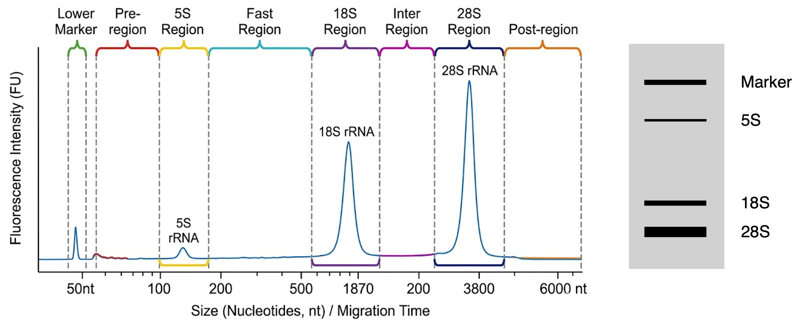
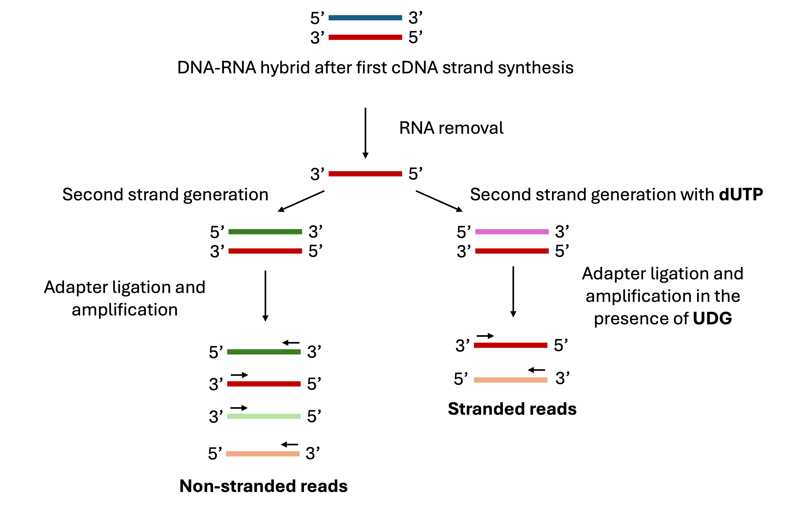

# RNA-seq

RNA-seq (RNA Sequencing) is the standard method for analyzing the **transcriptome**—the complete set of RNA transcripts in a cell or population of cells at a specific moment. Unlike the genome, which is relatively static, the transcriptome is highly dynamic, changing in response to environmental factors, drugs, or disease states.

The primary goal of RNA-seq is typically **Differential Expression Analysis**: identifying changes in gene expression between two conditions.

## RNA Quality Check: RNA Integrity Number (RIN)

Before any library preparation begins, the quality of the total RNA extracted from the cells must be assessed. The gold standard for this is the **RIN (RNA Integrity Number)**.

The RIN is a standardized numerical value from 1 (completely degraded) to 10 (perfectly intact), provided by automated electrophoresis devices, such as the bioanalyzer or the TapeStation. The calculation is based on the entire electrophoretic trace of the RNA sample, but it focuses on three main features:

- **The 28S and 18S peaks:** In eukaryotes, these are the two largest ribosomal RNA species. In a healthy cell, the 28S:18S ratio should be approximately 2.0. As RNA degrades, these peaks shrink.
- **The degradation window:** This is the area between the 5S/small RNA peak and the 18S peak. As the long rRNA molecules break into smaller pieces, this valley starts to fill up with noise.
- **The Pre-Region:** High-quality RNA has a very clean baseline before the 18S peak. High signal here indicates significant fragmentation.

## RNA Enrichment Strategies

Total RNA is dominated by **ribosomal RNA (rRNA)**, which accounts for >90% of the molecules in a cell but provides almost no useful biological information for most studies, so an enrichment step where the RNA of interest is selected is required. The goal of the RNA-seq experiment determines the enrichment strategy; in the most common approaches, the analysis focuses on fully-mature mRNA. In this scenario, mRNAs are enriched through the use of **oligo(dT)-coated magnetics beads**, taking advantage of the fact that most mature eukaryotic mRNAs are polyadenylated, but rRNAs are not.

However, sometimes the analysis needs to include **non-polyadenylated RNAs**, such as prokaryotic RNA, histone RNA, and some long non-coding RNAs (lncRNAs). In these cases, the use of oligo(dT) would result in the loss of not only the rRNA, but also of the RNA of interest, so a **depletion** strategy is used instead: biotinylated DNA probes that are perfectly complementary to the 18S, 28S, 5S, and 5.8S ribosomal RNA sequences are added. These probes bind to the rRNA, and then Streptavidin beads are used to pull the rRNA-probe complexes out of the solution.
Additionally, in degraded or FFPE samples the poly-A tail is often separated from the rest of the gene, so a ribo-depletion step is also required. If oligo(dT) are used, they will bind to the fragmented poly-A tails, and the nanodrop would show a normal concentration of RNA, but the library will have almost no data. Therefore, while more expensive, ribo-depletion is more robust method when handling low-quality samples.

**Note:** even with standard library prep, checking for overrepresented sequences (like rRNA) and filtering them with tools such as SortMeRNA or BBduk in case they appear as overrepresented sequences in the fastQ step is a good safeguard to improve mapping efficiency and quantification accuracy.

## RNA fragmentation

As most NGS protocols, RNA-seq starts with a fragmentation step, to generate smaller fragments that can be processed by the sequencer after cDNA generation. The goal for most Illumina libraries is a fragment size of ~200–300 bp However, because RNA is single-stranded and much more fragile than DNA, sonication is not recommended. It generates local heat and cavitation that can damage the RNA, and it might contain traces of RNase. The go-to method for RNA is **chemical fragmentation**, based on a combination of heat (94°C) and a buffer containing bivalent metal ions (like Zn or Mg). At high temperatures, the metal ions act as Lewis acids. They coordinate with the oxygen atoms in the phosphodiester backbone of the RNA, making the backbone susceptible to hydrolysis (breaking the bond using a water molecule).

| RIN | Quality | Strategy | Fragmentation | Note |
|-----|---------|----------|---------------|------|
| 8-10 | Excellent | Poly-A/Ribo-depletion | Standard heat-Mg | Ideal for high-coverage mRNA-seq |
| 6-7 | Acceptable | Recommended ribo-depletion | Standard heat-Mg | Watch for "3' bias" if using Poly-A selection |
| 2-5 | Highly degraded | Ribosomal depletion mandatory | Skip or heavily reduce | Use DV200 to assess if sample is even sequenceable |

  
   
  <em>Representation of an electropherogram and a virtual gel from a high-quality RNA extraction</em>

 

DV200: percentage of RNA fragments that are longer than 200 nucleotides. If the DV200 is >30%, the sample is usually "salvageable" for a specialized Ribo-depletion library.

## cDNA Generation

The most critical challenge of RNA-seq is that Illumina sequencers (and most other platforms) cannot sequence RNA directly; they require a stable, double-stranded DNA template. Therefore, the first step in any RNA-seq protocol is converting RNA into complementary DNA (cDNA). Since the RNA is fragmented in a previous step, the poly-A can no longer be used to prime the reverse transcriptase (RT) activity. The standard priming method consists on the use of **random hexameres**, 6-nucleotide random sequences that bind all along the RNA fragments, allowing the reverse transcriptase to initiate synthesis regardless of the original 3' or 5' position. After this initial synthesis by the RT, an RNA-DNA hybrid is formed.

Next, the second strand of the cDNA is generated. For this step, the polymerase is added together with a dNTP mix containing dUTP instead of dTTP. The presence of Uracil allows for marking of this second strand, differentiating it from the cDNA strand that was originally generated from the RNA fragment. To remove the RNA strand, some master mixes use a polymerase with 5'->3' **exonuclease activity**, which removes the RNA while synthetizing the second strand, while other protocols contain a specific **RNase H** treatment step.

This cDNA is subjected to all the classic NGS pre-processing steps (end-repair, A-tailing, ligation, and size selection) before PCR amplification. Importantly, in RNA-seq, the **strandness** of the DNA molecules wants to be conserved, and that's why the presence of dUTP is important: the mix for this PCR contains the UDG enzyme, which degrades the chain that includes Uracil. Now the polymerase will only copy the information from the first chain produced during cDNA generation, e.g the one that harbors the original information from the RNA. This specific dUTP workflow is technically referred to as **reverse stranded** or **ISR** (Inward-Stranded-Reverse). This is because the first sequencing read (R1) is mapped to the antisense (template) strand of the genome.

  
   
  <em>Non-stranded vs stranded workflow for RNA-seq</em>

 

## The Importance of Strandedness

The primary reason strandedness is required is that the genome is bidirectional. While RNA polymerase always synthesizes in a 5′->3′ direction, it can use either of the two DNA strands as a template. If two genes reside on the same region but on different strands of the DNA, without the strandness method there would be no way for the aligner to know which of the two was the one corresponding to the original RNA molecule.

Additionally, many loci produce non-coding antisense transcripts that overlap with protein-coding genes. Preserving the orientation of the original RNA allows researchers to study these regulatory RNAs independently from their sense counterparts.

By using the dUTP method, the library becomes "directional." Because the second strand is degraded by the UDG enzyme at the start of PCR, the resulting sequencing reads strictly represent the first-strand cDNA. This allows the aligner to map reads back to the correct strand of the reference genome, ensuring accurate gene counting and transcript identification.

## Unique Molecular Identifiers (UMIs)

Unique Molecular Identifiers (UMIs) are short, random nucleotide sequences (typically 6–12 bp) attached to individual RNA molecules during the cDNA generation or adapter ligation steps. In most specialized protocols, UMI sequences are integrated into the oligonucleotide primers used for reverse transcription (e.g., attached to oligo(dT) or random hexamer primers) or built directly into the sequencing adapters.

The primary function of a UMI is to uniquely label each molecule before amplification. This allows the bioinformatic pipeline to distinguish between true biological duplicates (multiple identical RNA molecules from a high-expression gene) and technical PCR duplicates (clones generated during library enrichment). Importantly, each RNA molecule is bound to a unique UMI, providing a unique "barcode" to every original transcript prior to PCR amplification, thereby allowing distinction between:

- **True biological duplicates:** Multiple identical RNA molecules from a high-expression gene (different UMIs, same mapping position).

- **Technical PCR duplicates:** Clones generated during library enrichment (same UMI, same mapping position).

Reads that share UMI and map to the same location (start/finish) can then be **collapsed** (counted as one read), therefore reducing PCR amplification bias.

In bulk RNA-seq experiments, UMIs are usually not used. In these cases, duplicates are not removed, because it is not possible to distinguish between biological and technical replicates. However, their use is highly recommendable when dealing with low yield or degraded samples, where PCR bias can really distort quantification.

