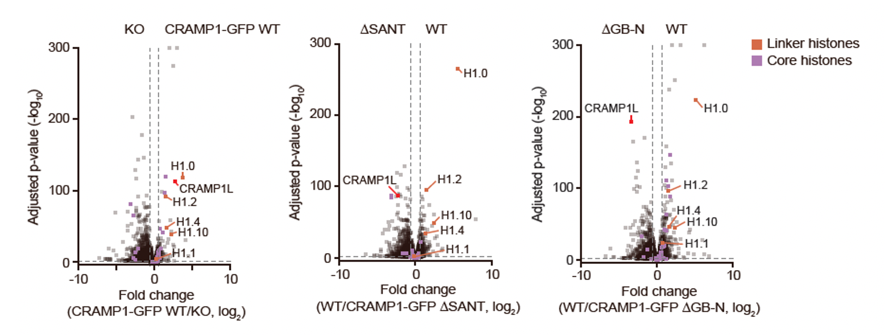

# RNA-seq Analysis Workflow

In this section, we go through the computational workflow for RNA-seq analysis starting from the generated alignment files. For technical details on the preferred aligners (such as STAR or HISAT2) and the reasoning behind splice-aware mapping, please refer to the [Alignment & Mapping](../02_Mapping_&_Alignment/02_aligners.md) section of this manual.

## Quantification of reads

The BAM files generated during the alignment contain the coordinates of the detected genes, but not the number of copies that were detected. To convert the reads into a digital **count matrix**, the go-to option in the feature of the Subread binary package, [featureCounts](https://subread.sourceforge.net/featureCounts.html). Here is the [link](https://bioconductor.org/packages/release/bioc/html/Rsubread.html) for R users, where featureCounts is wrapped in the Bioconductor package Rsubread. It is very fast and memory efficient, and it takes a GTF annotation file to define the boundaries between exons and genes. **Important note:** if the GTF doesn't match the genome build, the counts will be zero. 
The 3 critical settings that must be taken into account when using featureCounts are the following:

- **Strandness** (unstranded, forward stranded, or reverse stranded (standard dUTP/Illumina workflow): Picking the wrong one will lead to a massive decrease in the count number.
- **Multi-mapping:** Usually, reads that map to multiple places are ignored to avoid noise, but in some cases (like repetitive elements), it might be needed to switch this on.
- **Paired-end:** Must be switched on when analyzing paired-end reads.

The manual for the featureCounts package can be found [here](https://subread.sourceforge.net/SubreadUsersGuide.pdf).

This package outputs a tab-delimited file with the number of reads, where rows are Gene IDs and columns are your individual samples (**count matrix**).

## Differential Expression

### DESeq2

For the identification of differentially expressed genes, the R/Bioconductor package [DESeq2](https://bioconductor.org/packages/release/bioc/html/DESeq2.html) is the industry standard. It works on a **DESeq2 object**, constructed from a count matrix (usually provided by featureCounts) with the number of reads, with the genes as rows and the samples as columns, and a metadata matrix containing sample information (replicate, condition…).

Example of a count matrix:

 

| Gene | Sample1 | Sample2 | Sample3 | Sample4 | Sample5 | Sample6 |
|------|---------|----------|---------|---------|----------|---------|
| GeneA | 123 | 98 | 112 | 304 | 350 | 335 |
| GeneB | 7 | 15 | 4 | 6 | 7 | 12 |
| GeneC | 300 | 250 | 289 | 150 | 123 | 98 |

 

Example of a metadata matrix:

 

| Sample | Condition | Replicate |
|--------|-----------|-----------|
| Sample1 | Control | 1 |
| Sample2 | Control | 2 |
| Sample3 | Control | 3 |
| Sample4 | Treated | 1 |
| Sample5 | Treated | 2 |
| Sample6 | Treated | 3 |

 

When analyzing differential expression, DESeq2 does the following three things:

- **Normalization:** It calculates a scaling factor for each sample. It doesn't just divide by the total number of reads (which is what TPM or RPKM does); it uses a median-of-ratios method. This ensures that a single, massively over-expressed gene doesn't skew the normalization for every other gene in the sample.
- **Dispersion estimation:** RNA-seq data is overdispersed, meaning the variance grows faster than the mean. DESeq2 uses a **Negative Binomial distribution** to model this biological noise, shrinking the dispersion estimates of individual genes toward a global trend to make the analysis more robust against outliers.
- **Statistical testing:** It performs a statistical test (**Wald test**)to determine if the change in expression between the conditions is greater than what would be expected by random chance.

It outputs a table containing:

- **basemean:** The average expression across all samples.
- **log2FoldChange (LFC):** The magnitude of the change (e.g., a value of 1 means a 2-fold increase; a value of -1 represents a 2-fold decrease).
- **The adjusted p-value (padj):** Corrects for multiple testing, controlling for false discovery rate (FDR), using the Benjamini-Hochberg correction. Let´s say we have a p-value of 0.01. That means we have a 1% possibility of our result being a false positive. Padj drastically reduces this number, and in consequence a padj < 0.05 is considered the threshold for significance.

DESeq2 results are usually plotted as volcano plots, with the shrunk LFC (see below) in the x-axis, and the -log10(padj) on the y axis. This transformation turns tiny p-values into large positive numbers, placing the most significant genes at the top of the plot.

 

<em>Example of volcano plots obtained from an RNA-seq experiment analysed through the workflow explained in this repository.</em>

 

### LFC shrinkage

For genes with low counts or high variability, LFC estimates can be unstable and exaggerated in magnitude due to noise. For example, a gene moving from 1 read to 5 reads represents a "5-fold increase" that is likely statistically meaningless. The R/Bioconductor package [apeglm](https://bioconductor.org/packages/release/bioc/html/apeglm.html) shrinks LFCs per gene, instead of using a fixed prior like other methods, to get more stable, interpretable, and realistic estimates of gene expression changes — reducing noise without erasing true biological effects.

## Functional Enrichment

The final stage of an RNA-seq pipeline is functional enrichment analysis. While DESeq2 provides a list of Differentially Expressed Genes (DEGs), enrichment analysis identifies which cellular pathways, biological processes, or molecular components are statistically overrepresented within that list.

### Categorization Frameworks

#### GO (Gene Ontology)

The most widely used system, it categorizes genes into three structured domains:

- **Molecular function:** Activities at the molecular level (e.g., "ATP binding").
- **Biological process:** Larger "biological goals" (e.g., "DNA repair" or "signal transduction").
- **Cellular component:** Where the gene product is active (e.g., "Mitochondrial matrix").

#### KEGG (Kyoto Encyclopedia of Genes and Genomes)

A database that maps genes to specific metabolic and signaling pathways, providing a "map" of how genes interact within a system

### Background Gene Selection

When doing functional enrichment, a critical step is choosing the right background genes list. Using the complete genome is not advisable, since not all genes are detected in most experiments and this can inflate the results. It is therefore more correct to use only the genes that were tested for differential expression in the first place.

### Software & Visualization

The gold standard for functional enrichment analysis is the R/Bioconductor package **[clusterProfiler](https://bioconductor.org/packages/release/bioc/html/clusterProfiler.html)**. It allows for advanced visualization and GSEA (Gene Set Enrichment Analysis).

The standard output for this section includes **Dotplots** (showing the most enriched pathways by p-value and gene count) and **Cnetplots** (Gene-Concept Networks), which show the specific genes shared between different enriched pathways.
