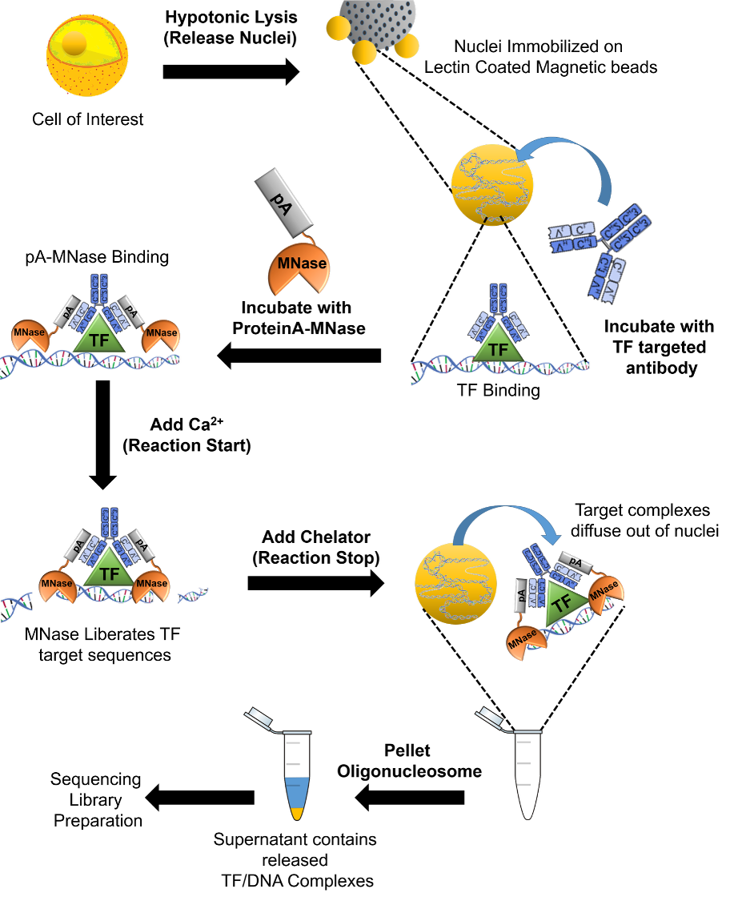
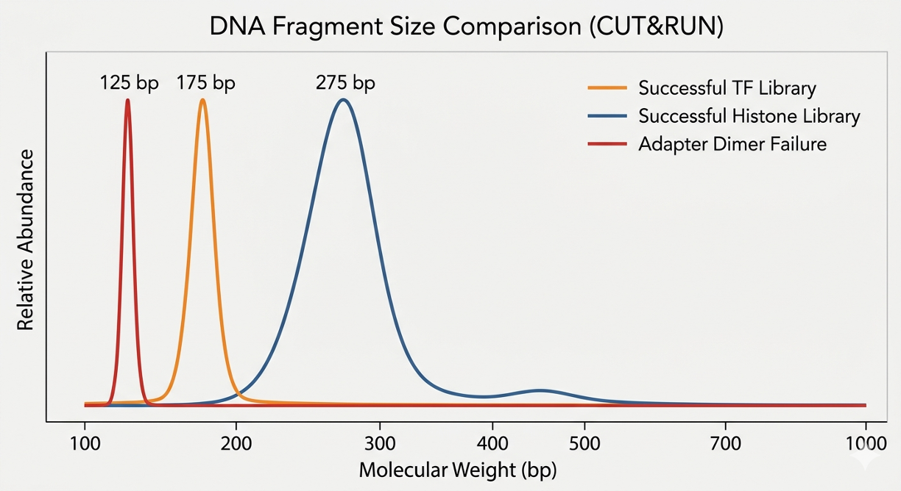

# CUT&RUN: Technical Details on Sample Preparation

CUT&RUN (Cleavage Under Targets and Release Using Nuclease) is an "in-situ" mapping strategy used to identify the binding sites of DNA-associated proteins, such as transcription factors and histone modifications. Unlike traditional ChIP-seq, which relies on random sonication of cross-linked chromatin, CUT&RUN utilizes a targeted approach within the cellular environment. Cells or nuclei are permeabilized, allowing a specific antibody to bind its target protein. A Protein A-Protein G-Micrococcal Nuclease **(pAG-MNase)** fusion protein then docks onto the antibody. Upon the addition of calcium, the nuclease is activated to precisely cleave the DNA only in the immediate vicinity of the protein-DNA complex.

These small, targeted fragments diffuse out of the nuclei and are collected for sequencing. This method results in extremely low background noise, requires significantly fewer cells (down to 100 cells or fewer in some protocols), and provides high-resolution mapping of protein-DNA interactions. Because the DNA is cleaved specifically at the site of interest, the resulting sequencing data is exceptionally clean, making it a "gold standard" for researchers working with limited sample material or requiring high-precision binding data.

 

  
  
   
  <em>"CUT&RUN Sequencing Workflow" by Mannan369 (2018), Wikimedia Commons. 
Licensed under CC BY-SA 4.0 International (https://creativecommons.org/licenses/by-sa/4.0/).
Source: https://commons.wikimedia.org/wiki/File:CUT%26RUN_Protocol.tif</em> 

 

## Fragment Size

While in other techniques, like RNA-seq, the size of the fragments is controlled during library prep, in CUT&RUN, fragments are generated during the protocol by the MNase. Because the nuclease cleaves specifically where the antibody is bound, the length of the resulting DNA is highly informative of the protein’s identity and its "footprint" on the genome. Generally, it is accepted that fragments <120 bp correspond to those bound by transcription factor, while 150 bp and 300 bp correspond to mono- and di-nucleosomes, respectively, indicating that the protein of interest is a histone or a histone binding protein. Fragments of 500 bp or above are usually considered background. Therefore, the SPRI step of the library prep is highly dependent on what is known about the protein of interest. In all cases, a double-sided size selection is recommended: first, a low ratio (~0.6x) is used to remove the big, uninformative pieces of DNA. The beads are discarded and the supernatant is kept. Depending on the type of protein being studied, the second SPRI, isolation step varies:

 

| Type of protein | Size (after adapter binding) | SPRI ratio | Purpose |
|-----------------|------------------------------|------------|---------|
| Transcription factor | 140-240 bp | 1x-1.2x | Captures small footprints while excluding <120 bp adapter dimers |
| Histone-binding factor | ~270 bp | 0.8×-0.9× | Captures nucleosomal units while aggressively cleaning out TF noise and dimers |

 

Now the DNA of interest will be bound to the beads, and the supernatant can be discarded. After a series of 80% ethanol washes, the purified library is eluted.

When assessing fragment size with the TapeStation, a clean peak at the target size, with no peak at 120 bp, should be observed. The presence of a sharp, dominant peak at 120–130 bp indicates that your SPRI ratio was too high (captured adapter dimers) or that the MNase digestion was insufficient, leaving the adapters with nothing to bind to but themselves.

When the binding nature of the protein is unknown, the goal is to preserve the entire biological spectrum—from tiny footprints to large nucleosomal structures. This is achieved through a 1.8x-2.0x SPRI isolation step. In this scenario, an adapter dimer peak is often unavoidable at the bench. In such cases, if the dimer signal exceeds the biological signal, alternative purification methods—such as automated gel excision (e.g., Pippin Prep) set to a >140 bp collection window—may be required to salvage the library for sequencing.

 

  
  
   
  <em>Different possibilities of fragment size distribution in a CUT&RUN experiment</em> 

 

While the TapeStation provides a physical assessment of the library before it hits the flow cell, it is essential to verify the fragment size distribution bioinformatically after sequencing. Tools such as [bedtools](https://bedtools.readthedocs.io/en/latest/) or the [bamPEFragmentSize](https://deeptools.readthedocs.io/en/develop/content/tools/bamPEFragmentSize.html) of deepTools are used on the aligned BAM files to generate a fragment size histogram. This step serves as a final quality control to ensure that the biological signal (e.g., the <120 bp transcription factor footprints or 150 bp nucleosomal peaks) was successfully captured and preserved throughout the sequencing process, and to confirm that the data is not dominated by technical artifacts like adapter dimers.

## The IgG Control

Every CUT&RUN experiment must include an IgG (non-specific antibody) control. The IgG sample should have very few mapped reads and a flat, noisy profile in the genome browser. If the IgG condition looks similar to the target antibody (same peaks, same signal), the enrichment is likely just background noise or open chromatin artifacts.

If the IgG shows a massive, high-molecular-weight smear on the TapeStation, it indicates a failure in the wash steps: the MNase wasn't washed away and was allowed to digest the genome globally, which defeats the purpose of the control.

Since the IgG is a low-complexity library—it represents only the rare, non-specific locations where the MNase happened to cut without antibody guidance-it should not be pooled at the same ratio as the actual samples: if the target is pooled at 4 nM, the IgG should often be pooled at 1 nM or 2 nM. This saves a lot of space on the flow cell that would otherwise be used to generate many duplicates from the unique fragments present in the IgG sample.

## PCR amplification & Handling of Duplicates

After the adapters are ligated to the MNase-cut fragments, the library must be amplified to reach the concentration required for sequencing (typically 0.5–10 nM). Most CUT&RUN protocols aim for 12–14 cycles. If the protein is a high-abundance histone mark, 10 cycles may be sufficient. The PCR reaction must use a high-fidelity polymerase and an optimized extension time. If the extension time is too long, the polymerase may favor longer fragments, causing the library to lose the tiny, 50 bp transcription factor footprints that are the hallmark of CUT&RUN.

A critical decision point in the CUT&RUN bioinformatic pipeline is the management of duplicate reads—identical fragments that map to the same genomic coordinates. While standard ChIP-seq protocols often mandate the removal of duplicates to mitigate PCR bias, CUT&RUN requires a more nuanced approach. Due to the targeted nature of pAG-MNase cleavage and the low starting cell numbers typical of CUT&RUN, multiple cells often yield identical DNA fragments. These are categorized as **biological duplicates** rather than technical artifacts. Indiscriminate removal of these reads can artificially truncate peak signal and reduce the dynamic range of the data, particularly for high-abundance targets like histone marks. Keeping the duplicate reads is recommended when PCR cycles are kept low (12–14 cycles) and the duplication rate remains within a standard range (<30–40%). This preserves the quantitative relationship between binding sites.

It is worth noting that is perfectly normal to see no DNA in the IgG sample, since in this sample there was no antibody to guide the MNase. The IgG conditions should never be run for more cycles than the experimental samples. If the IgG is amplified more, the background noise would be artificially inflated, and if it shows no DNA after the same number of cycles as the target, that is actually a sign of a very clean experiment with low non-specific binding.

## Quantification

While PCR amplification exponentially enriches for fragments with dual adapters, fluorometric methods may still over-estimate sequenceable library concentration due to the presence of non-amplified genomic fragments carried over through the SPRI steps and primer dimers. It is therefore advisable to obtain the molarity through qPCR, unless the TapeStation shows a clear, high-yield peak with no presence of adapter primers. 

