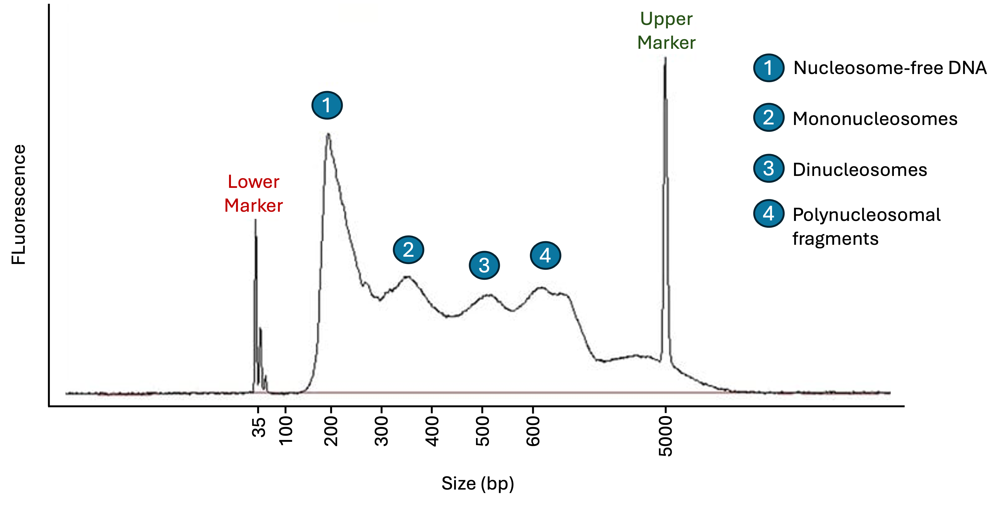

# ATAC-seq

Assay for Transposase-Accessible Chromatin using sequencing (ATAC-seq) is a powerful and rapid method used to map global chromatin accessibility. The technique relies on the action of a hyperactive **Tn5 transposase**, which simultaneously fragments the DNA and ligates sequencing adapters, a process known as **tagmentation**. Because the bulky Tn5 dimer can only access DNA that is not tightly wrapped around nucleosomes or obstructed by high-density protein complexes, the resulting sequencing reads are highly enriched in "open" regions, such as active promoters, enhancers, and other regulatory elements. By analyzing the density and distribution of these insertion sites, researchers can determine the regulatory landscape of a cell and identify shifts in chromatin reachability across different experimental conditions.

 

  
  
   
  <em>Description of the ATAC-seq technique. Adapted from "ATAC-Seq Figure" by Deema108 (2018), Wikimedia Commons. 
Licensed under Creative Commons Attribution-Share Alike 4.0 International (https://creativecommons.org/licenses/by-sa/4.0/deed.en).
Source: (https://commons.wikimedia.org/wiki/File:ATAC-Seq_Figure_.svg)</em>

 

## Tn5 Mechanism

The Tn5 transposase functions as a homodimer that is pre-loaded in vitro with synthetic, double-stranded 19-bp **Mosaic End** (ME) sequences of 19 bp attached to **truncated adapters** (for more information on truncated adapter, refer to the [library prepararion](../01_NGS_Foundations_&_Pre-processing/02_library_preparation.md) section of this repository). This pre-activated complex, known as **transposome**, physically scans for accessible, nucleosome-free DNA, where it simultaneously cleaves the genomic DNA backbone and ligates the ME-containing adapters to the new ends. The full-length sequencing adapters and i5/i7 barcodes are subsequently added during a limited-cycle PCR step.

## Tagmentation and Fragment Size Distribution

The fragment size profile of an ATAC-seq library is a direct reflection of chromatin architecture. Unlike other NGS methods where fragmentation is random, ATAC-seq fragments are generated by a hyperactive Tn5 transposase. Because Tn5 can only access histone-free regions, the resulting library shows a distinct periodicity when visualized on a TapeStation or Bioanalyzer, and this pattern allows for diagnosis of the experiment's quality. In a good ATAC-seq experiment, three main peaks are expected when looking at fragment size distribution:

- **Nucleosomal-free fragments (180-220 bp):** Corresponds to ~70 bp of open DNA + adapters
- **Mononucleosome peak (~300–330 bp):** Corresponds to ~147 bp of nucleosomal DNA + ~50 bp of linker DNA + adapters
- **Multinucleosome peaks (~500 bp, ~700 bp+):** Represent di- and tri-nucleosomal spans plus adapters

 

 
  
   
  <em>Representation of a TapeStation analysis of a succesful ATAC-seq experiment.</em>

 

### The 9 bp Tn5 Shift

Because Tn5 dimerizes when it cuts the DNA, the two Tn5 molecules are offset by 9 base pairs. Reads aligned to the + strand are shifted +4 bp and those on the – strand are shifted –5 bp. Therefore, ATAC-seq requires correction of read positions to represent the true cut sites. Most modern pipelines handle this automatically, but it should be verified before downstream analysis.

## SPRI Selection

To capture the diverse range of fragments generated in ATAC-seq, a single-sided 1.8x SPRI clean-up is typically utilized. This high ratio ensures the retention of the small, highly informative nucleosome-free fragments while removing primer dimers (<130 bp).

While a single-sided 1.8x SPRI is standard for high-quality cell suspensions, protocols such as Omni-ATAC—designed for frozen tissues or high-metabolic cell types—often utilize a double-sided SPRI (0.5x → 1.2–1.5x). Double-sided selection results in a cleaner-looking TapeStation profile, but it is more technically demanding. If the second ratio is too low (e.g., stopping at 1.1x), significant amounts of the biological multi-nucleosomal signal may be lost, reducing the library's complexity.
