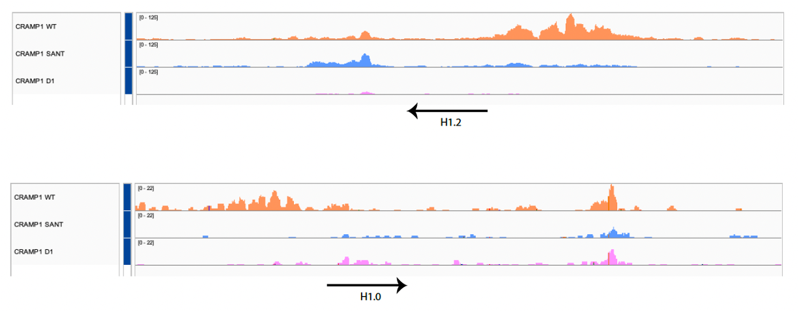
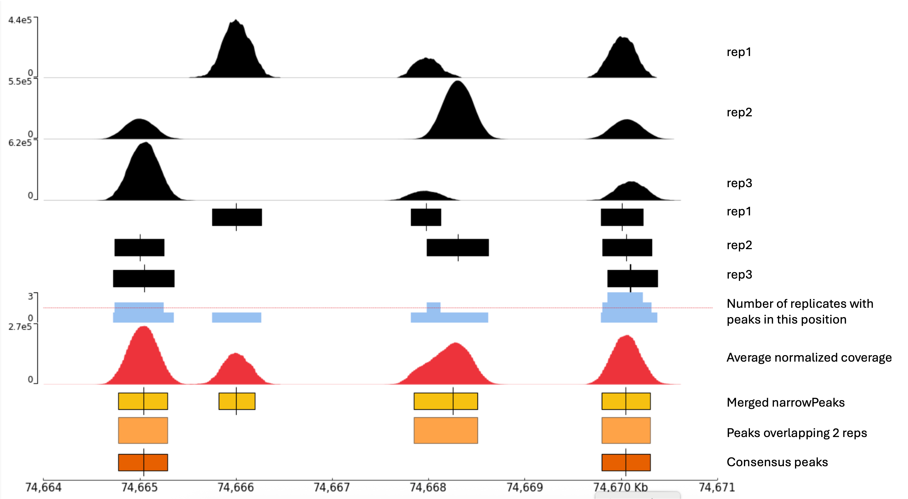

# CUT&RUN: Analysis Workflow

## Early Visualization

Before doing any analysis on the generated BAM files (the preferred tools for this can be found [here](../02_Mapping_&_Alignment/02_aligners.md)), it is good practice to check the coverage from each replicate with visualization tools like [SeqMonk](https://www.bioinformatics.babraham.ac.uk/projects/seqmonk/), [IGV](https://igv.org) or the [UCSC browser](https://genome.ucsc.edu). This serves as a QC control, where enrichment at expected regions, replicate similarity and whole genome background can be assessed. The profile for a good CUT&RUN experiment should show:

- Sharp, discrete enrichment sites (especially when analyzing transcription factors)
- Low background between peaks
- Clear enrichment at known loci (if there is previous data)
- Fragment size behavior consistent with biology

**Important note:** When raw BAM files are viewed, the IgG control may appear to have peaks as tall as the experimental samples. This is caused by an artifact of auto-scaling within the browser. Because the IgG library contains very few reads, the background noise is zoomed in upon by the software to fill the vertical space of the track. Bigwig generation and spike-in normalization must be completed before the true, scaled relationship between the samples can be observed.

## Spike-in Normalization & Scaling Factor

Because CUT&RUN has such a low background signal, traditional normalization methods (like total read count) can be misleading. It is critical to normalize using spike-in DNA (usually E. coli or yeast DNA added during the protocol). For a deeper dive into the theory behind this, see the section on [Spike-in Correction](../02_Mapping_&_Alignment/03_post-alignment_processing.md) of this repository.

In CUT&RUN, we normalize technical variations by calculating a **scaling factor** for each sample:

$$\text{Scaling Factor} = \frac{\max(\text{spike-in reads across all samples})}{\text{sample spike-in reads}}$$

​This normalizes technical variations between samples, since the spike-in  DNA goes through the same processes as the samples themselves. If spike-in fails for a sample (very low counts), scaling may produce extreme inflation and should be excluded.

## Coverage Files: bedGraph vs BigWig

Once the reads have been mapped and filtered, the next step in a CUT&RUN workflow is generating the **coverage files**. These files translate discrete aligned reads into a continuous signal profile representing the number of fragments overlapping each genomic region.

There are two ways to represent coverage from BAM files: generating **bedGraph** or **BigWig** files. bedGraph are plain text versions, easily readable, while BigWig are a compressed binary version, lighter but not human-readable. In consequence, BigWig files are smaller and easier to read for software but, unlike bedGraph, they cannot be edited.

Both bedGraph and BigWig files are usually generated with the **bamcoverage** function of [deepTools](https://deeptools.readthedocs.io/en/develop/content/tools/bamCoverage.html). This tool is preferred because it allows the spike-in scaling factor to be applied during the conversion process, thereby producing already normalized bedGraph/BigWig files.

The choice between generating bedGraph or BigWig files is largely dictated by the requirements of the downstream peak-calling software (see next section), but the generation of BigWig files is always recommended to ensure smooth, high-performance visualization in IGV or other genome browsers. It is possible to generate BigWig files from bedGraph with [bedGraphToBigWig](https://anaconda.org/channels/bioconda/packages/ucsc-bedgraphtobigwig/overview).

## Peak Calling

Following the generation of normalized coverage profiles, the final critical step in the CUT&RUN pipeline is peak calling. This process uses statistical models to identify genomic regions where the density of mapped fragments is significantly higher than the background noise (**peaks**), indicating a **true protein-DNA binding event** or histone modification. The goal of this step is to produce a BED or narrowPeak file containing the coordinates of these high-confidence binding sites for downstream functional analysis.

### BED and narrowPeak files

Peak information is stored in tab-delimited files known as **BED**(browser extensible data). They contain the chromosome number and the start and end of the coordinates for the different detected peaks. However, other elements can be attached to them for downstream analysis. Another common format of files used to store peak information is **narrowPeak**. These are basically 10-column BED files, with additional information such as the peak "summit" (the exact point of highest signal), fold-enrichment, and statistical significance (p-values and q-values).

### Peak calling tools

The two main tools used for peak-calling are [MACS3](https://macs3-project.github.io/MACS/) and [SEACR](https://github.com/FredHutch/SEACR). While both can be used for CUT&RUN analysis, **SEACR** (Simple Enrichment Analysis of CUT&RUN) was specifically created for this purpose. Opposed to ChIP-seq, CUT&RUN´s extremely low-background signal, with clear and spiked peaks, makes it perfect for an analysis with a threshold-based algorithm like the one SEACR uses, instead of statistical background models. Importantly, SEACR requires input in the form of bedGraph files and returns BED files, which can later be converted to narrowpeaks, while MACS3 uses BAM files as input and returns narrowpeaks. It is worth mentioning that SEACR can be run in “relaxed” or “stringent” modes, with the latter usually being the preferred option due to the low background typical of CUT&RUN experiments.
**MACS3**, on the other hand is better for the detection of broad histone marks and other “wider” peaks, and is therefore the go-to option when analyzing ChIP-seq data, but also useful in specific CUT&RUN experiments. It takes BAM files as input and returns BED files, so bedGraph generation is normally skipped in a MACS3-based workflow. 

Importantly, in CUT&RUN, peak callers use the IgG control to establish a baseline. By comparing the experimental sample to the IgG, the algorithm can distinguish between true biological enrichment and technical artifacts or "open chromatin" noise.

### Visualization in genome browsers

As mentioned above, the ideal file format to visualize enrichment is BigWig. Because SEACR provides bedGraph files, converting these to BigWig with the bedGraphToBigWig tool is highly recommended to inspect the data. In the case of MACS3, BigWig files are generated from BAM files with bamcoverage.

It is also good practice to obtain BigWig files from merged replicates (see below). Comparing these tracks to the ones of the individual replicates in a browser allows for a qualitative sanity check to ensure that the merged signal accurately represents the individual replicates and that no unexpected artifacts were introduced during the pooling process.

 

  
   
  <em>Example of coverage visualization from a CUT&RUN experiment in IGV</em>

 

## Handling of Replicates

Unlike algorithms that use statistical background modeling, SEACR does not have a built-in function to handle biological replicates simultaneously. Because it is highly sensitive to coverage depth, a specific workflow must be adopted to ensure the resulting peak set is both reproducible and statistically sound. There are two primary approaches to analyzing experiments with multiple replicates:

- **BAM merging:** BAM files are merged per condition with [samtools merge](https://www.htslib.org/doc/samtools-merge.html), converted to bedGraph, and processed through SEACR to obtain a consensus peak set. Read counts are then quantified at these peak locations for each individual replicate. While this is often the recommended method for maximizing sensitivity, it requires that all replicates are of similar quality; therefore, a rigorous pre-QC step is mandatory.
- **Intersection:** SEACR is run on each replicate independently. A final peak set is generated by keeping only the peaks present in a specific number of replicates (e.g., 2 out of 3) using a process called **intersection**. While this method ensures high reproducibility, it can be less powerful for detecting low-signal peaks than the merged approach.

To capture the benefits of both sensitivity and reproducibility, a common approach is to combine these strategies:

- Replicate BAM files are merged for all conditions, converted to bedGraph, and processed through SEACR.
- Peaks are called in independent replicates. Only those present in at least 2 out of 3 replicates are identified (using [bedtools multiinter](https://bedtools.readthedocs.io/en/latest/content/tools/multiinter.html).
- The reproducible peaks from step 2 are intersected with the master set from step 1 (using [bedtools intersect](https://bedtools.readthedocs.io/en/latest/content/tools/intersect.html) to build the **final consensus peak set**.

Why is intersection necessary? When files are merged, subtle differences in the signal shape of individual replicates can cause shifts in peak boundaries. Intersecting ensures that the reported peak width is consistent with the individual replicates (which is likely more accurate) while confirming the peak's presence in the higher-depth merged file. Furthermore, merging can create artifacts where weak signals from multiple replicates combine to "trick" SEACR into calling a peak that wasn't reproducible; intersection effectively prevents these artifacts from being included in the final data.

 

  
   
  <em>Consensus peak logic. Adapted from "Consensus Peak Calling for ATAC-seq and CUT and RUN Replicates", Lucille Delisle (2026) https://github.com/galaxyproject/iwc/tree/main/workflows/epigenetics/consensus-peaks. Under MIT license</em>

 

### Read counting on consensus peaks

After identifying the consensus peaks, the next step is to count the reads on those peaks across all replicates for all conditions. First, all consensus peaks files are merged into a **single unique consensus BED file** that will contain the peaks detected in all conditions with [bedtools merge](https://bedtools.readthedocs.io/en/latest/content/tools/merge.html). A matrix is then built with these BED and the BigWig files using [multiBigWigSummary](https://deeptools.readthedocs.io/en/develop/content/tools/multiBigwigSummary.html). Alternatively, if BAM are the preferred format, bedtools coverage or deepTools multicov would be the go-to option. This matrix serves as the foundation for downstream statistical testing and differential enrichment analysis.

## Biological Interpretation

Once a consensus peak set has been generated and quantified, the focus shifts from data processing to biological discovery. This involves characterizing the peaks based on their genomic location, associated genes, and DNA sequence properties. 

### Comparison of conditions

When multiple experimental conditions were analyzed, the first step to find differences between said conditions is to look for peaks that are exclusive to a specific condition, or peaks that are absent in one but not in the rest. This is achieved with **bedtools intersect**.

### Region of interest (ROI) visualization

If a signal across a specific region of interest needs to be analyzed, first a A BED file of coordinates must be generated. These can be specific genes of interest from Ensembl/NCBI or broad categories such as "all promoters" (±2 kb from the transcription start site (TSS)). Once the BED file is generated, **deepTools computeMatrix** can be used on the BigWig files to map the signal density across these regions. The output is visualized via **deepTools plotHeatmap** or **deepTools plotProfile**.

 

  
   
  <em>Example of enrichment at a regions of interest from a CUT&RUN experiment</em>

 

### Peak annotation & functional analysis

After identifying peaks, these can be annotated to genomic features, such as promoters, enhancers or intergenic regions with the R/Bioconductor package **[ChIP-Seeker](https://bioconductor.org/packages/release/bioc/html/ChIPseeker.html)**.

This allows for functional enrichment analysis (GO Terms/KEGG Pathways) to see if the identified peaks are associated with specific biological processes.

### Motif enrichment analysis

Finally, the enrichment of specific motifs, such as known transcription factor binding sites can be analyzed. The table below summarizes the main tools used for motif enrichment and their goals:

 

| Tool | Focus | Best for |
| :--- | :--- | :--- |
| [HOMER](http://homer.ucsd.edu/homer/) | Known motifs + simple *de novo* | Quick, reliable enrichment of established motifs |
| [MEME Suite](https://meme-suite.org/meme/) | Advanced *de novo* discovery | Identifying novel or complex motifs with high statistical rigor |
| [TOBIAS](https://github.com/loosolab/TOBIAS) | TF footprinting / activity | Analyzing differential TF occupancy within open chromatin (often paired with ATAC-seq) |

