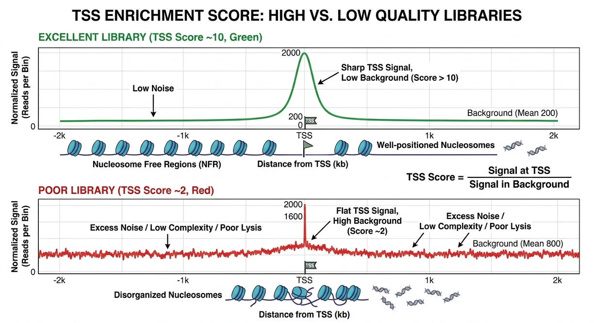

# Analysis Workflow for ATAC-seq

Unless otherwise specified, this workflow assumes paired-end ATAC-seq, which is required for accurate fragment size reconstruction and nucleosome pattern analysis.

## Alignment Strategy

As mentioned in the mapping section of this repository, both [bowtie2](https://github.com/benlangmead/bowtie2) and [BWA-MEME2](https://github.com/kaist-ina/BWA-MEME) are valid options for mapping when analyzing ATAC-seq data, with the second being preferred for two main reasons:

- It can soft-clip the ends of reads if they contain a bit of adapter sequence that wasn't fully trimmed, whereas Bowtie2 might reject the entire read as an "unmapped" fragment. This maximizes the recovery of short, nucleosome-free fragments.
- In low-input ATAC-seq, Tn5 can occasionally create chimeric fragments. BWA-MEM2 handles these complex alignments better, preventing false-positive peaks.

## Post-alignment QC

### Mitochondrial DNA

As mentioned before in this repository, a major hurdle in ATAC-seq is the high affinity of the Tn5 transposase for mitochondrial DNA. Because mtDNA is not protected by histones, it acts as a "sink" for the transposase, leading to a disproportionately high number of reads mapping to the mitochondrial genome (chrM).

Mitochondrial reads represent a significant waste of sequencing depth. For example, if a sample has 50% mtDNA, the effective depth for analyzing informative sequences is halved. It is therefore critical that the cell lysis and washes steps during sample preparation are properly performed, to reduce the presence of mtDNA as much as possible.

The remaining reads mapping to mtDNA are removed in the processing steps after mapping using [samtools](https://www.htslib.org) or [Picard](https://broadinstitute.github.io/picard/). If they are not removed, the massive signal from the mitochondrial genome will alter the scaling of the genome browser tracks, making the nuclear peaks look like tiny bumps in comparison.

### The Tn5 shift

As mentioned in the [ATAC-seq sample prep](./03_ATAC-seq_sample_prep.md) section of this repository, the mechanism of the Tn5 enzyme leads to a 9 bp shift in the reads: + strand are shifted +4 bp and those on the – strand are shifted –5 bp. Importantly, standard aligners like BWA or Bowtie2 do not handle this. While such a small distance might seem negligible, depending on the experiment this shift needs to be addressed.

A common approach is to use [alignmentSieve](https://deeptools.readthedocs.io/en/latest/content/tools/alignmentSieve.html) from the deepTools suite with the `--ATACshift` flag to shift the read in the BAM files and generate the coverage files from these. This leads to a better representation of the peaks when looking at the resultant BigWig files in a genome browser.

When calling peaks from paired-end reads, the standard pipeline is to call peaks from the original files with `MACS3 -f BAMPE`. The software doesn't look at individual read ends, but rather at the entire fragment (the space between R1 and R2). Since the +4/-5bp shift happens at both ends of the fragment, for fragments of standard size (300 bp) this shift is negligible when the aim of the experiment is to assess chromatin accessibility, because the center of the fragment remains virtually unchanged.

For applications requiring base-pair resolution, such as TF footprinting or motif analysis, Tn5 shift correction is essential to recover precise cut-site positions. In these cases, shifted reads generated with `alignmentSieve --ATACshift` are used to construct cut-site–level signal tracks, which provide the high-resolution input required to detect local patterns of cut depletion and enrichment associated with protein-DNA interactions. MACS3 peaks are typically used as a complementary step to define regions of open chromatin in which footprinting analysis is performed, rather than as a direct indicator of TF binding or protection sites. Importantly, MACS3 identifies accessible regions based on fragment enrichment and **does not resolve base-pair level binding events**. Footprinting is then performed using dedicated tools such as TOBIAS, HINT-ATAC (Regulatory Genomics Toolbox), or CENTIPEDE, which model cut-site distributions within accessible regions to infer transcription factor occupancy from local protection patterns rather than peak boundaries.

**Note:** Shifting the reads leads to a change in the genomic coordinates of the fragments, so the resultant BAM files must be re-sorted and indexed for downstream processing.

### TSS enrichment score

TSS enrichment is a standard ATAC-seq quality metric that measures how strongly reads accumulate around transcription start sites. In high-quality ATAC-seq, accessible promoters show a sharp peak of signal exactly at the TSS and a well-defined nucleosome pattern flanking it. Low-quality libraries (e.g., too much background, poor nuclei prep, excessive mitochondrial contamination) show a flat or noisy profile.
The TSS enrichment is calculated after mtDNA reads removal, with methods like [ATACseqQC](https://bioconductor.org/packages/release/bioc/html/ATACseqQC.html) or [deepTools](https://deeptools.readthedocs.io/en/latest/) (computeMatrix + plotProfile):  reads are aggregated across thousands of annotated TSSs (±2 kb window), signal is normalized to the background flanking regions and the final TSS enrichment score is obtained with the formula (signal at TSS) / (signal in background). A score > 10 is usually considered as an excellent ATAC-seq experiment, while 6-10 contains some acceptable background noise and a score below 5 suggests over-digestion, poor nuclei prep, or low library complexity.

 

  
  
   
  <em>TSS enrichment score comparison of a low-quality vs a high quality ATAC-seq library.</em>

 

## Coverage Files

Once the reads have been mapped and filtered for mitochondrial contamination, the next step is generating coverage files. These files translate discrete, aligned fragments into a continuous signal profile (**tracks**) that represents the density of open chromatin across the genome.

The standard format for coverage files in ATAC-seq is BigWig, generated with the [bamcoverage](https://deeptools.readthedocs.io/en/develop/content/tools/bamCoverage.html) function of deepTools. These are compressed, indexed binary files that can be used for visualization in genome browsers like [SeqMonk](https://www.bioinformatics.babraham.ac.uk/projects/seqmonk/), [IGV](https://igv.org) or the [UCSC Genome Browser](https://genome.ucsc.edu). There are two important things to take into account when generating BigWig files:

- They must be generated from the 9 bp shifted coordinates. This ensures the signal accurately reflects the Tn5 cut site centers, resulting in sharp, high-resolution peaks.
- Normalization: because different sequencing runs produce a different amount of total reads, the height of the peaks cannot be compared between samples without normalizing. The most common method to do this is using **CPM (counts per million)**. Another method, **RPKM (reads per kilobase per million)**, is similar to CPM but also adjusts for the size of the bin.

$$
\text{CPM} = \frac{\text{Reads in bin} \times 1,000,000}{\text{Total mapped reads}}
$$

## Peak Calling

The goal of peak calling in ATAC-seq is to identify regions of the genome significantly enriched for transposition events compared to the random genomic background. Unlike CUT&RUN, which has an extremely "clean" background, ATAC-seq contains a much higher level of ambient genomic noise due to the nature of the Tn5 tagmentation in a complex nuclear environment, which makes SEACR a poor choice when selecting a peak calling tool. The standard for ATAC-seq is [MACS3](https://macs3-project.github.io/MACS/), which uses a sophisticated Poisson distribution to model the aforementioned background and distinguish true accessibility from random noise.

MACS3 returns **narrowPeak** files, 10 column BED files with additional information:

| chrom | chromStart | chromEnd | name   | score | strand | signalValue | pValue | qValue | peak |
|-------|------------|----------|--------|-------|--------|-------------|--------|--------|------|
| chr1  | 345000     | 345150   | peak_1 | 1000  | .      | 10.5        | 50.2   | 45.0   | 75   |
| chr1  | 567800     | 567920   | peak_2 | 850   | .      | 8.2         | 40.1   | 35.6   | 60   |
| chr2  | 123400     | 123550   | peak_3 | 920   | .      | 9.8         | 48.7   | 42.3   | 80   |
| chr2  | 789000     | 789120   | peak_4 | 780   | .      | 7.5         | 38.9   | 33.1   | 55   |
| chr3  | 456700     | 456820   | peak_5 | 670   | .      | 6.9         | 30.4   | 28.0   | 50   |

The last column contains the **summit** of the peak, the exact base pair with the highest signal, which is critical for downstream applications like transcription factor motif discovery.

## Handling of Replicates

While MACS3 allows for multiple BAM files to be provided as input simultaneously, it internally pools these reads into a single dataset. While this increases statistical power to find low-signal peaks, it does not inherently filter for reproducibility. A peak present in only one replicate (due to technical artifact) may still be called. Therefore, a **hybrid consensus workflow**, similar to the one used in CUT&RUN analysis, remains the gold standard to ensure biological relevance.

First, the BAM files from all replicates of each condition are merged and a master peak set is created with MACS3. Simultaneously, peaks are called from each independent replicate. Next, regions present in at least N-1 replicates (e.g., 2 out of 3) are identified with [bedtools multiinter](https://bedtools.readthedocs.io/en/latest/content/tools/multiinter.html). Lastly, a final set is generated by keeping only peaks present in a majority of replicates (e.g., 2 out of 3) with [bedtools intersect](https://bedtools.readthedocs.io/en/latest/content/tools/intersect.html) in a process called **intersection**. This ensures high reproducibility but may lose smaller, genuine peaks that fall just below the statistical threshold in one replicate.

Once a final consensus BED file per condition is generated, the next step is to quantify the accessibility of these regions for statistical comparison. All condition-specific consensus files are merged into a **single unique BED file** with [bedtools merge](https://bedtools.readthedocs.io/en/latest/content/tools/merge.html), and the reads mapping to the peaks present in this consensus file are quantified. This ensures that if a region is open in the control but closed in the treated group, it is still measured in both.

**Note:** The manual consensus building described above (using bedtools) is essential for custom pipelines or counting with standalone tools like [featureCounts](https://subread.sourceforge.net/featureCounts.html). However, if the downstream analysis will be performed using the R package [DiffBind](https://bioconductor.org/packages/release/bioc/html/DiffBind.html), this manual intersection and merging is unnecessary. DiffBind automates the consensus peak generation internally when provided with a sample sheet of individual BAM and narrowPeak files.

### Using featureCounts to count reads on consensus peaks

The standard tool used to count reads after the consensus peak BED file generation is the feature of the RSubRead package [featureCounts](https://subread.sourceforge.net/featureCounts.html). While bedtools could do this, featureCounts is specifically optimized for high-performance counting. It is strand-aware, handles paired-end data natively, and produces a clean summary of how many reads were successfully assigned to peaks versus how many are just background. featureCounts takes the filtered, indexed BAM files and the master consensus peak set, and it counts reads on each peak for each sample. Then it returns a **count matrix**, a tab-delimited file with different metrics:

  
| Geneid | Chr | Start | End | Strand | Length | WT_Rep1 | WT_Rep2 | KO_Rep1 | KO_Rep2 |
| :--- | :--- | :--- | :--- | :--- | :--- | :--- | :--- | :--- | :--- |
| **Peak_1** | chr1 | 10045 | 10500 | . | 455 | 145 | 132 | 10 | 12 |
| **Peak_2** | chr1 | 21500 | 21900 | . | 400 | 22 | 18 | 250 | 280 |
| **Peak_3** | chr2 | 78200 | 78650 | . | 450 | 88 | 92 | 85 | 90 |
| **Peak_4** | chr10 | 500120 | 500400 | . | 280 | 310 | 295 | 45 | 38 |

The first few columns (Chr, Start, End, Length) are metadata. If differential accessibility studies with DESeq2 (see below) are to be performed, these are stripped in R, leaving only the **Peak IDs** as rows and the **Sample Counts** as columns.

## The DiffBind Workflow

While the manual consensus workflow explained above offers maximum transparency, many researchers prefer using the R/Bioconductor package [DiffBind](https://bioconductor.org/packages/devel/bioc/vignettes/DiffBind/inst/doc/DiffBind.pdf/), which automates the transition from peak files to differential analysis.

DiffBind needs to be provided a **sample sheet** (as .csv), containing the paths to the BAM files, their respective narrowPeak files previously generated with MACS3, and (optionally) the condition that each sample belongs to. It creates a consensus peak, it re-centers every peak around its summit and makes them all a fixed width, and counts the reads in those standardized windows. 

The primary output is a **DBA Object** in R, which can be exported as a report. This report contains the genomic coordinates of all consensus peaks, their normalized accessibility scores, and the statistical significance of their changes between conditions (Fold Change and FDR). To obtain these data diffBind uses DESeq2 or EdgeR internally (depending on the settings). Additionally, DiffBind provides built-in functions to generate PCA plots and binding affinity heatmaps, which are essential for validating the reproducibility of biological replicates, as well as volcano plots to quickly inspect open or closed chromatin regions.

While DiffBind provides a convenient, integrated R environment for standard differential analysis and re-centered peak quantification, a manual featureCounts approach was also documented to allow for maximum flexibility. This modular path preserves the original MACS3 peak boundaries and produces a raw count matrix that can be easily integrated into custom statistical pipelines beyond the standard DiffBind/DESeq2 framework.

## Biological Interpretation

The workflow for ATAC-seq varies a lot depending on the aim of the experiment.

### Global chromatin compaction analysis

If the aim of the experiment is only to assess if a certain treatment produces changes in the overall chromatin compaction, there are various ways to do it:

- The most straightforward way is to look at fragment size distribution, which can be done with [deepTools bamPEFragmentSize](https://deeptools.readthedocs.io/en/develop/content/tools/bamPEFragmentSize.html) or the R package [ATACseqQC](https://bioconductor.org/packages/release/bioc/html/ATACseqQC.html). More open chromatin gives an increase in the nucleosome-free fragments (50 bp, ~180 bp total length including adapters) and mononucleosomal fragments, while a shift toward larger fragments suggests global compaction.
- The genome can be split into fixed windows, or bins, (10 kb for example), count reads with [deepTools multiBamSummary](https://deeptools.readthedocs.io/en/develop/content/tools/multiBamSummary.html) and plot a PCA to see if different chromatin states correlate between conditions.

### Identification of differentially accessible regions (DARs)

To determine if the difference in read counts between conditions is due to biological significance or just random sampling noise, [DESeq2](https://bioconductor.org/packages/release/bioc/html/DESeq2.html) in the preferred tool. In biological samples, the data is typically overdispersed, because the variance grows very quick with the mean count or, in other terms, it follows a **negative binomial distribution**. To correct for this, DESeq2 uses a **shrinkage** method to provide more stable estimates of fold change, especially for peaks with low counts or high variability. This prevents a single noisy replicate from creating a false positive.

It is worth mentioning that DESeq2 uses its own normalization (the median of ratios) method, which accounts for different factors like sequencing depth or composition bias (when a few peaks are accumulating most of the reads in a sample). Consequently, it is important the DESeq2 is given the count matrix from featureCounts, which contains raw (non-normalized reads), and not data that had been normalized before.

The input for DESeq2 is the cleaned count matrix from featureCounts (see above), and a file containing sample information (replicate, condition, etc). This allows for the generation of a **DESeq2 object**, on which the analysis will be run. 

DESeq2 returns a **Log2-fold Change (LFC)** indicating the changes in accessibility for each region (peak) and a **padj (adjusted p-value)**, obtained through Benjamini-Hochberg correction.

Once DARs are identified, they are typically annotated to the nearest gene using tools like ChIPseeker or Homer to determine which biological pathways (via Gene Ontology) are being regulated by the changes in chromatin accessibility

## The FRiP Score

The **Fraction of Reads in Peaks (FRiP)** is a key quality control metric for ATAC-seq. It measures the enrichment of the library by calculating the percentage of all mapped reads that fall within the identified peak regions:

$$FRiP = \frac{\text{Number of reads overlapping peaks}}{\text{Total number of mapped reads}}$$

  
| FRiP | Quality | Verdict |
| :--- | :--- | :--- |
| >0.3 | Excellent | Outstanding enrichment; the peaks are very clear and the background is low |
| 0.2-0.3 | Good | Standard for a high-quality ATAC-seq experiment |
| 0.1-0.2 | Acceptable | Useable data, but may require more conservative statistical filtering |
| <0.1 | Poor | Indicates a noisy library. This can be caused by over-tagmentation, poor cell viability, or low complexity in the library |

The FRiP score is calculated automatically during diffBind analysis. When using the featureCounts method, it can be obtained by taking the sum of the counts in the count matrix and dividing it by the total reads (obtained via [samtools flagstat](https://www.htslib.org/doc/samtools-flagstat.html))
