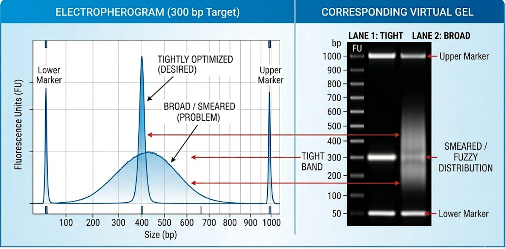

# Fragment Size Distribution

Fragment size distribution analysis provides a readout of the size composition of sequencing libraries prior to sequencing. It is an essential quality control step in library preparation, as it reflects both the efficiency of fragmentation and size selection, as well as the presence of unwanted by-products such as adapter dimers or high molecular weight contaminants.

Unlike the sequencing-based QC metrics covered in the next section, fragment size profiles are not derived from sequencing reads, but from physical separation of DNA molecules using microfluidic electrophoresis systems. For this reason, they represent a direct measurement of library structure before sequencing.

This section focuses on interpreting abnormal electropherogram patterns and linking them to their most likely causes.

## Presence of a Prominent, Short Fragment Peak

A strong, sharp peak in the ~120–150 bp range is typically indicative of an overrepresentation of short library species. In most sequencing libraries, this population corresponds to adapter-ligated short fragments rather than true biological signal.

- **Adapter dimers:** An excess or an incorrect ratio with gDNA of the adapters used in the library preparation, can lead to their dimerization, creating a characteristic sharp peak of low molecular weight on the TapeStation profile. To avoid this, the final concentration of each primer should be between 0.2-0-5 µM, but it's essential to take into account the primer-to-template ratio: if there is too much primer relative to very few DNA fragments, the primers are more likely to find each other (dimerization) than they are to find a rare DNA template, while it has to be made sure that the reaction doesn't reach primer starvation before the desired library concentration is achieved.
The presence of adapter dimers can also be a consequence of a too permissive SPRI clean-up step. In this cases, a further 0.6x or 0.8x (e.g., 40µL beads to 50µL DNA) AMPure bead cleanup is recommended.
- **Inefficient removal of smaller fragments:** If the fragment size selection strategy fails to remove smaller, non-biologically relevant fragments, or if the PCR amplification step of the library prep is biased towards small molecules, these will also contribute to the formation of a smaller fragment size peak, likely widening the one originated by the adapter dimer´s one. In this case, both the SPRI and PCR conditions should be reviewed.
- **Enzymatic activity:** In enzyme-based chromatin assays (ATAC-seq, CUT&RUN), this pattern may also reflect excessive enzymatic activity relative to available accessible chromatin, resulting in a shift toward minimal fragment products.
- **Primer dimers:** In protocols that require PCR amplification, the primers used in this step can dimerize and generate a small fragment size peak, of lower molecular weight than adapter primers (~60-80). To prevent this, the primer concentration added into the mix, and the its ratio with the gDNA to be amplified need to be carefully considered. Additionally, it is advisable to use a hot-start polymerase (see above), and sometimes to increase the annealing Temperature 2°C with problematic libraries to increase stringency.  

 

  
   
  <em>TapeStation profile showing a typical case of a library containing adapter primer contamination.</em>

 

## Broad or Smeared Fragment Size Distribution

A wide, smeared distribution centered at the target size is problematic because it causes size-biased stochastic clustering, where the smaller fragments in the tail of the smear preferentially occupy the flow cell, leading to uneven coverage and reduced sequencing effective yield.

- **DNA/RNA degradation:** Poor sample handling before and during library prep can lead to genome degradation, leading to a a very wide peak, that sometimes fuses with the adapter dimer one, and the virtual gel shows a smeary signal.
- **Over-fragmentation or excessive enzymatic digestion:** Sonicating conditions in case of mechanical fragmentation, and enzyme concentration and digestion time, in assays in which fragmentation is dependent on enzymatic activity, should be tightly controlled.
- **Suboptimal size selection conditions:** Using too permissive SPRI ratios lead to a less stringent size selection and therefore to wider or smeared distributions.

 

  
   
  <em>TapeStation profile showing a typical case of a library containing adapter primer contamination.</em>

 

When the DNA/RNA has been degraded during the process, the electropherogram shows 

If an **HMW** (high molecular weight) smear is present, this is usually due to a problem with the fragmentation or sonication conditions.

The presence of a sharp, dominant peak at 120–130 bp indicates that your SPRI ratio was too high (captured adapter dimers) or that the MNase digestion was insufficient, leaving the adapters with nothing to bind to but themselves.

When the binding nature of the protein is unknown, the goal is to preserve the entire biological spectrum—from tiny footprints to large nucleosomal structures. This is achieved through a 1.8x-2.0x SPRI isolation step. In this scenario, an adapter dimer peak is often unavoidable at the bench. In such cases, if the dimer signal exceeds the biological signal, alternative purification methods—such as automated gel excision (e.g., Pippin Prep) set to a >140 bp collection window—may be required to salvage the library for sequencing.
